Deployment

San Diego Art Outlet is deployed on [Heroku](https://san-diego-art-outlet-2960cce580c0.herokuapp.com/).

To use the code available publicly on GitHub for local deployment:

(Some of these instruction assume you are using VSCode and have already installed Python 3.12.8 and Python extension for VS Code in your computer, and that you have set up a new repository in GitHub to push your local code to and a virtual environment in VSCode.)

1. Open VS Code and select File > Open Folder

2. Select your vscode-projects folder and click on Select Folder button (or Open on Mac).

3. In VS Code, in the top menu select Terminal > New Terminal.

4. Clone the San Diego Art Outlet respository that is on GitHub by running the following command in your terminal:

- `git clone https://github.com/ChristineEC/sd_art_outlet`

Connect it to a GitHub repository of your own so you can push to GitHub for version control--but don't push it yet.

Once you have done this, the code is available to you locally. Ensure that you have python 3.12.8 running in your virtual environment.

To do this, still in VS Code click the gear icon in the lower left of your screen to open the Command Palette. There click on create e and select Python: Create Environment.

Choose Venv from the dropdown list and then choose the python version you have installed on your computer. This project uses Python 3.12.8, so that is recommended. Click OK. Check to see if you now have a .venv folder in your files pane in VS Code.

Close your terminal and reopen it and check if you see Python 3.12.8(or other)('venv':venv) or just Python 3.12.8('venv') at the bottom right of your terminal. If so, you're ready for the next step.

Create a .gitignore file in the root directory if there isn't already one, and ensure it contains the following lines:

`.venv`

`env.py`

`*.sqlite3`

`*.pyc`

`__pycache__`

Create an env.py file, and in it, place the following, to start (you will add more later):

1. `import os`
2.
3. `os.environ.setdefault("SECRET_KEY", "YOUR_OWN_SECRET_KEY_GOES_HERE")`
4. `os.environ.setdefault("DEVELOPMENT", "1")`
5. 

You can generate a secret key from [RandomKeygen](https://randomkeygen.com/) or similar service.

Now you need to install the project's dependencies, that are located in requirements.txt.  To do so, type the following command in your terminal:

`pip install -r requirements.txt`

Now attempt to run the local server by typing in 
- python manage.py runserver (or possibly python3 manage.py runserver), depending on your system. I have needed to use the former.

Use the link that will appear in your terminal to open the server, and if you get an error message saying "Disallowed host at /", copy what it says you need to add there to ALLOWED_HOSTS in your settings.py file (currently around line 19 in that file). It will look something like '127.0.0'. While you are there, you should also add 'localhost' to the list of allowed hosts, as you will need this later for the Stripe webhooks. Refresh the page and you should now see the website.

CREATE A STRIPE ACCOUNT

Go to Stripe.com and create an account. Then go to the developers menu at the bottom left and select API Reference (or otherwise access your developers dashboard, as the procedure may change), to access your Publishable key (which starts with pk_test) and your Secret key (which starts with sk_test).

In your env.py file, include the following two lines and place your pk and sk there:

`os.environ.setdefault("STRIPE_PUBLIC_KEY", "your pk here")`
`os.environ.setdefault("STRIPE_SECRET_KEY", "your sk here")`

To use and test your webhooks, you need three terminals open: 
1. your normal server (Python server) that you use to preview your webpage;
2. stripe portal
3. terminal to send your test webhook commands.

I will not go into testing webhooks here, but you do need to get your webhook secret at this point. So run your python server as usual with python manage.py runserver.

In the second terminal type this command: **stripe listen --forward-to localhost:8000/checkout/wh/**

Once you send that command, look in the terminal for your webhook signing secret. The terminal will say "Your webhook signing secret is whsec_`<a long string of numbers and letters>`".  Add the webhook secret that starts with 'whsec' to your env.py file like this:

`os.environ.setdefault("STRIPE_WH_SECRET", "your whsec here")`

Make sure you've added 'localhost' to the list of ALLOWED_HOSTS in your settings.py file.

So now everything should be up and running.

This is a good time to push everything to your remote repository.

DEPLOYING TO HEROKU

To deploy to Heroku, you will need to switch to another database such as Postgres, as SQLite is not supported by Heroku. I will assume use of a Postgres database. Create your database, either independently or in Heroku (a paid service, not covered here). Be ready to copy the database url into your code in the step after this next one.

First, go to Heroku and create an account if you don't already have one. Log in, then click on the button at the top right of your screen that says New, and choose Create New App. Give your app a name such as sdartoutlet, for example, and choose the region where you are located. Then click Create App. That will bring you to your app's dashboard, where you need to navigate to Settings from the menue towards the top left. Scroll down and choose a deployment method. These instruction are for deploying from a GitHub repository. Choose Connect to GitHub.
Scroll down to find the section on Config vars and click on the Reveal Config Vars button.

Now you need to connect your local database to your Postgres database using VS Code. 

Go to your settings.py, code out what is there for DATABASES, and replace it with this:
`DATABASES = {'default': dj_database_url.parse("your database url here")}`

Type `python manage.py showmigrations` in your terminal, and you should see a list of the migrations from SQLite to be made to Postgres, with all the boxes unchecked, and all the models of the project listed in the migrations to be made.

Type `python manage.py migrate` into the terminal and hit enter.
If you want to include the data from San Diego Art Outlet that is provided in the various fixtures files, do so by using the command

`python manage.py loaddata mediums.json artists.json artworks.json events.json

Do not push to GitHub while your database url is showing in settings.py!

After the migration (and possible uploading of fixtures), you can code back in DATABASES like it was before and delete the line above containing your database url. The Postgres database url will be entered in config vars in Heroku.

Go to your Heroku app, and get the app's URL. Copy it into ALLOWED_HOSTS in your settings.py, removing the "https://" from the start and the "/" from the end.

Gunicorn should be already installed as part of your dependencies. But double check, as deployment will fail without it.

Now push everything to GitHub.

Now you need to set up the environment variables in Heroku.

First include a variable called DISABLE_COLLECTSTATIC and set it to 1 in you Heroku config vars. Create a new secret key and include that in config vars as well as SECRET_KEY (with your new secret key as the value).

Navigate to the Deploy menu in your Heroku app. Connect it to your GitHub repository (as your Deployment Method), if not already done. Click Enable Automatic Deploys, then click Deploy Branch. After it finishes deploying, click Open App.

At this point, the website will not have picked up any of the project's static files, due to the DISABLE_COLLECTSTATIC having been set to 1. This has been done so that you can now set up an AWS S3 bucket to serve the project's static files. 

SET UP SERVING STATIC FILES FROM AMAZON WEB SERVICES

To serve the static files from Amazon Web Services, a cloud-based storage service, requires a little work. (If I had known, I may have used Cloudinary instead!)  Here are the steps you need to take:

1. Go to AWS and create an account if you don't already have one. Create a personal account. Enter your credit card number (though the service is free up to certain limits.)

2. With your account created, go to aws.amazon.com and log in at the upper right to access the management console. At the top of the screen, search for "S3" in the searchbar and then click on S3 under Services. From there, click on the button Create Bucket.

3. Enter a bucket name (such as artoutlet), select 'ACLs enabled', select 'Bucket owner preferred', and **deselect** 'Block all public acess', checking the box to verify you know about the risk of public access. Then click "create bucket".

4. With the bucket created, click on the bucket name to view details.

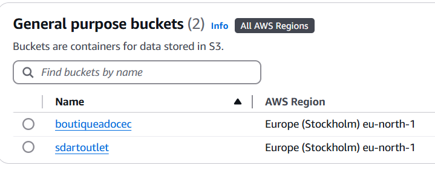

Your screen will now look like this (without the /media and /static files there yet):

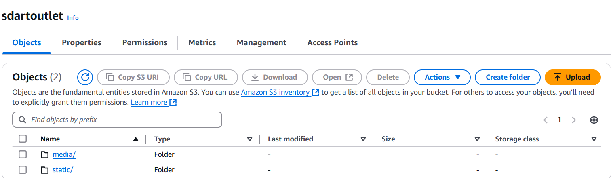

Click on the properties tag just below your bucket name, then scroll down to the Static Web Hosting section, click the edit button there and click "Enable". Enter `index.html` and `error.html` in the Index and Error document input fields and click "save changes."

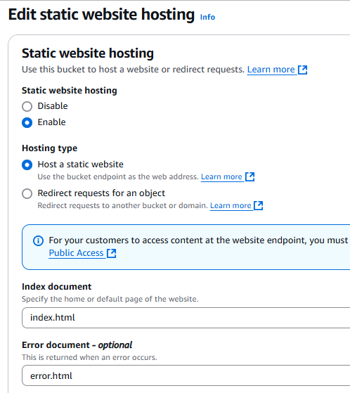

Now navigate to the Permissions tab in your bucket (see two images above).
Scroll down to the cross-origin-resource-sharing (CORS) section and click "edit" at the top right of the box.

Enter the following code there:

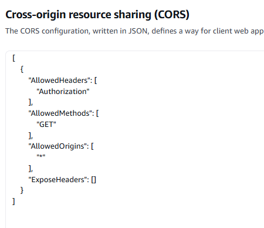

Click 'Save changes'.

Now your need to add a bucket policy. Still under the Permissions tab in your bucket (or open the tab again), scroll to the bucket policy section, and click edit at the top right of the box. Now at the top of the box again, click Policy Generator to generate a policy for you to use. That brings you to the AWS Policy Generator page, where you need to select the type of policy: choose S3 Bucket Policy from the dropdown.

Below Effect (selected!), and in the input box next to Principal, enter '*' without the quotes.  For the Action below, select GetObject from the dropdown menu. Go back to the bucket policy editor to copy your Bucket ARN, which will look something like arn:aws:s3:::mybucket, return to the Policy Generator, and past the ARN into the ARN input and click Add Statement.

**NOTE:** Keep your ARN handy somewhere to paste in elsewhere in a later step, too!

Then scroll down and click "Generate Policy".

Something like this will pop up:

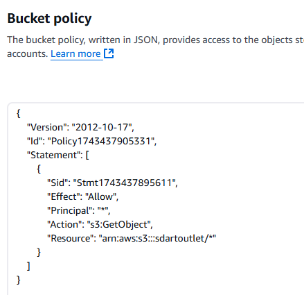

Copy it, go back to the policy editor, and paste it in. Make sure that you add "/*" (without the quotes) at the end of the Resource value in the code you just pasted. Scroll down and click Save Changes.

Now your need to edit the Access Control List (ACL): Still under the Permissions tab, scroll down to the Access Control List (ACL) section and click Edit. Then on that page click 'List' for Everyone (public access). Click checkbox that you agree. Click Save Changes.

Your permissions will then be this:

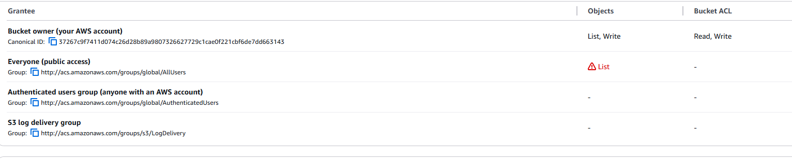

**Create a user** to access the bucket. 

Go back to the Services menu, or just type in the topmost searchbar to find IAM, which is AWS's Identity and Access Management. Click on IAM. From there, look to the left side mentu and click on User Groups. Enter a group name like manage-sdart-bucket or whatever you want, then scroll to bottom and click Create User Group.

**Create a policy:** 

Click Policies in the left-side menu. Referring to the image below, click on the JSON tab.

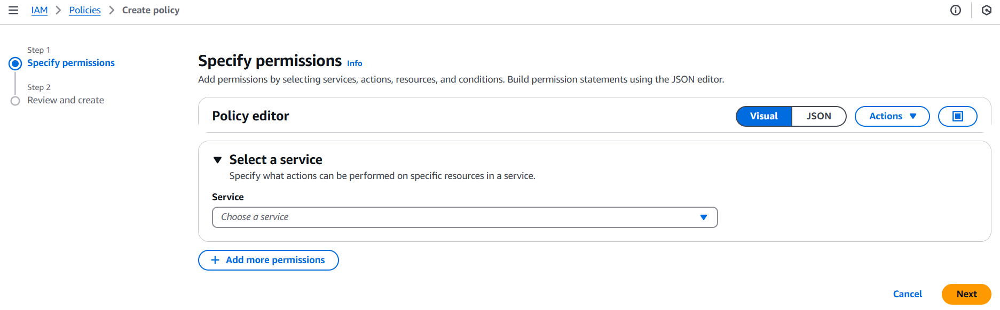

After you click the JSON tab, your screen will look like this:
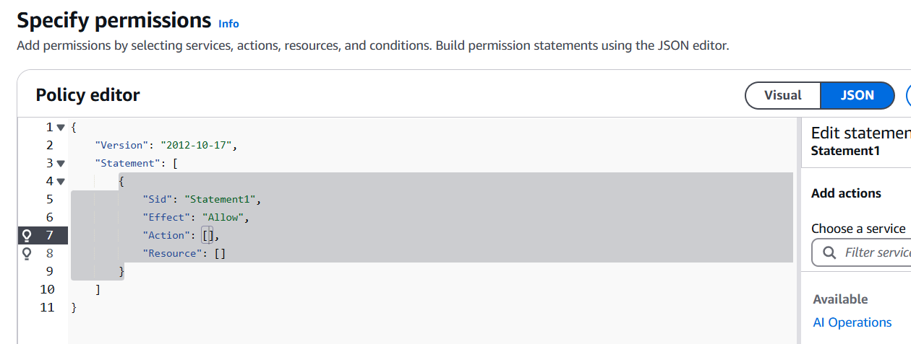
 Then click the Actions button, and your screen will look like this:
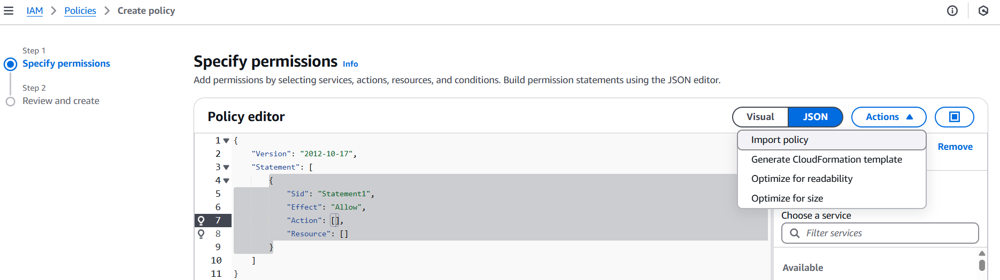

Choose Import Policy from the Actions dropdown.

You will see the list of a lot of policies to choose from again. Instead of seaching through all the policy options shown at this point, just search for s3 in the Policies search box and then choose the option "AmazonS3FullAccess" and click the "Import Policy" button at the bottom right of the box.

You will need to paste in your ARN twice now for resources, in the Policy Editor shown above. 

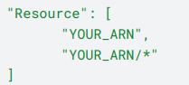

(Thanks Code Institute for the image snippet! And for much of this material, though I have added my own (and a few shortcuts!)

Scroll to bottom and click Next. Enter a policy name and description, scroll down and click Create Policy.

**Add the policy to your User Group**

Click 'user groups' in the menu to the left, go to the permissions tab and from the 'add permissions' dropdown, click 'attach policies'. Search for your policy by name and select it, then click the button in the lower right of the box Attach Policies.

**Create a User**

Click 'users' in the lefthand side menu. Create a user with a username and click Next.

Select the User Group you created previously, click Next. Scroll down and click 'Create User.'

**Create an access key**

Click on your new user and click 'security credentials'.

Scroll down to access keys and click "create access key".

Select "application running outside of AWS and click Next.

Click 'create access key'. Then click download .csv file and Done. The CSV file will contain your AWS_ACCESS_KEY_ID and AWS_SECRET_ACCESS_KEY. 

Place these in your Heroku config vars.

Also place USE_AWS as a config var in Heroku and set it to True.

So, in Heroku, the following configuration variables are required (More on the Email_host_pass and user below):

Only enter the config vars that you have values for so far, but this is the complete list you will need by the end.

- AWS_ACCESS_KEY_ID
- AWS_SECRET_KEY_ID
- DATABASE_URL
- EMAIL_HOST_PASS
- EMAIL_HOST_USER  (the email from which emails should be sent)
- SECRET_KEY (This is your secret key. Recommended to be different than the one you use in development.)
- STRIPE_PUBLIC_KEY
- STRIPE_SECRET_KEY
- STRIPE_WH_SECRET
- USE_AWS (Set equal to 1)
 
In settings.py you now need to go set the AWS_STORAGE_BUCKET_NAME to your storage bucket name, as it will contain the name from the San Diego Art Outlet project. You do this in the first line under 
`if 'USE_AWS' in os.environ` in settings.py.

Remove the DISABLE_COLLECTSTATIC variable from Heroku config vars now.

By pushing all of these changes to GitHub now, Heroku will run collectstatic and will collect the static and media folders in the django project and create the two directories in your AWS bucket, like this:

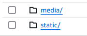

The last step is to set up sending real emails with Django. Since this has already been prepared in most of the settings, all you have to do is use or create your own gmail, set it to two-step verfification in the gmail account settings, then create a new app-specific password.

To get the password you'll need, search in the top search bar of google account settings for "App passwords" and choose that option. Click create to create a new app specific password (giving it a name). A generated app password will pop up. Copy and click done.

The password is a 16 digit code. It needs to be pasted into your Heroku config variable for EMAIL_HOST_PASS. For EMAIL_HOST_USER, use the gmail account for which you just set up the app specific password, and of course you need to use that email in settings.py instead of the sdartoutlet email wherever that appears.

The final step is to go to your Stripe Dashboard and add your app's URL as a webhook endpoint. Click Developers then Webhooks, and in the top right of your screen, click Add Destination and just endter your app's url followed by "/webhooks/wh/" without the quotes.

For "Select Events" you can just Select all Events, then click Add, and at the bottom of the page click Add endpoint.

Click Reveal to access the Signing Secret for your endpoint, and last, add that signing secret (that starts with whsec) as the value for your Heroku config var STRIPE_WH_SECRET. (By the way, config vars cannot be entered without values, so this should be the first time you enter the config var STRIPE_WH_SECRET, now that you have its value.)

To test your webhooks and your app's purchase functionality, use the credit card 4242 4242 4242 4242 with any real address, any 3-digit verification code and zip code.

Good luck!
