# San Diego Art Outlet

[San Diego Art Outlet](https://san-diego-art-outlet-2960cce580c0.herokuapp.com/) is deployed on Heroku and available on [GitHub](https://github.com/ChristineEC/sd_art_outlet).

For convenience, here are written out links:
- `https://san-diego-art-outlet-2960cce580c0.herokuapp.com/`
- `https://github.com/ChristineEC/sd_art_outlet`

## Table of Contents
1. [Purpose and Business Model](#purpose-and-business-model)
2. [Search Engine Optimization (SEO) and Social Media Marketing](#search-engine-optimization-seo-and-social-media-marketing)
3. [UX](#ux)
    - [First impressions](#first-impressions)
    - [Color scheme](#color-scheme)
    - [Fonts](#fonts)
    - [Structure and Navigation](#structure-and-navigation)
    - [Error handling and messages](#error-handling-and-messages)
    - [Content](#content)
    - [Responsiveness](#responsiveness)
    - [Accessibility](#accessibility)
4. [Agile Methods and Tools](#agile-methods-and-tools)
    - [GitHub project, user stories, issues, epics, milestones, MoSCoW labels, and kanban](#github-project-user-stories-issues-epics-milestones-moscow-labels-and-kanban)
    - [Wireframes](#wireframes)
    - [Entity Relationship Diagram](#entity-relationship-diagram)
5. [Features and User Stories](#features-and-user-stories)
    - [User Stories Table](#user-stories-table)
    - [Homepage, Navigation and Footer](#homepage-navigation-and-footer)
    - [Shop an Gallery](#shop-and-gallery)
    - [Artwork Detail Page](#artwork-detail-page)
    - [The Shopping Cart](#the-shopping-cart)
    - [Artists page](#artists-page)
    - [Artists' pages](#artists-pages)
    - [Custom Order Request](#custom-order-request)

## Purpose and Business Model
San Diego Art Outlet is a business-to-consumer (B2C) e-commerce application designed to 
- allow working artists in the San Diego area to market and sell their art to individuals
- encourage site visitors to buy from the available selection or put in a custom-order request
- to market to potential collaborators, such as other artists who may wish to sell on the site, and
- to publicize local events where art lovers can see their art and meet the artists in person

The business model is that of an artists' collective. Artists sell their own work on this common platform and are responsible for setting their prices, adding their artworks for sale (to be verified by site-owner or authorized admin before publishing), providing the content for their artist's page, and so on. Most individual artists are not able to receive credit card payments, so they have limited choices for selling online, and most of those choices involve platforms such as Etsy, which have become overcrowded (and overwhelming for the shopper) and which take a cut for each piece sold. (The site owner of San Diego Art Outlet, or the collective, could choose to charge a monthly fee instead, if they wished. This aspect is flexible.) Other sites offer little or no extra marketing value for the artists. SD Art Outlet would market locally, on social media and through presence at local art events and neighborhood street fairs, which are held throughout the year in San Diego due to the excellent weather but can often be financially out of reach for many individual artists. In addition, the collective could place art on commission in local cafes, bars, restaurants, etc., as is frequently done, though this aspect is not addressed in the project. See the SEO and Marketing section for more about this.

Artists ship their art directly to the consumer. Shipping costs are included in the price of each piece, as it would not be feasible to set reasonable shipping rates for objects that vary so wildly in size, shape, and weight, and which may have other shipping considerations, such as fragility. The site ships only within the United States, and consumers who place orders on the site receive an email confirmation stating they, if they have provided an address outside the 50 states, they will soon be contacted to arrange in-person pick-up or a refund, or shipping to U.S. territories (such as Puerto Rico) to be arranged at cost. 

The primary target audience consists of the consumer looking for local, affordable art that fits their style, living space and budget. The cost of living is extremely high in San Diego, and most people don't have the budget to acquire high-end art. Many people would be attracted to the idea of being able to choose art at a reasonable price that would fit their space. So while specific pieces of art are for sale on the site, a large part of the business is expected to come from custom orders. That is, a customer will see something they like on the site, or an artist they like, then ask that artist to make them something in a certain range of colors, a style, and a size that will fit the space they have in mind, with a price to fit their budget: art-to-order, as it were. The word "outlet" is used in the title because it strongly connotes "inexpensive".

## UX
### First impressions
The first-time visitor to the site is immediately aware of the purpose of the site and the nature of goods offered through the use of a colorful art-easel favicon and an identical icon in the title, a prominent shopping cart icon in the page header, and clear headlines that navigation (mentioning, e.g., "San Diego local artists," "affordable art," "shop," "full gallery" and "custom-order", as well as "events"), with an attractive image of one of the artworks.
### Color scheme
The background for the website is a light-blue watercolor painting, one of the works for sale on the site. It was originally planned to be white in order to let the artworks themselves provide the color, but after working with the project for a time, I decided that the white background was decidedly unartistic; thus, the change. Text is black in order to provide a high contrast with the light-blue. Muted text is a charcoal gray.
### Fonts
In keeping with the laid-back Southern California lifestyle and surfing culture, the logo font is "Original Surfer." It is used in the logo header and in the footer for the newletter signup form, as well as for the header in the full gallery (as opposed to the shop). This latter difference helps to differentiate the two pages (gallery vs. shop), as they are otherwise quite similar. The rest of the site's headlines use Josephine Sans, which gives the site an artsy, welcoming, relaxed feel. The body is set to Lato, as Josephine Sans is only for larger font sizes. (I discovered part way through that non-headers were simply rending as the default browser font, so Lato was added, as it matches well with Josephine Sans and is a clear, easy-to-read font.)
### Structure and navigation
Site structure and navigation consist of elements that users have come to expect on e-commerce sites, with a prominent shopping cart, a homepage showing the two major options--to explore the gallery or go straight to the shop--with the overview of artworks on either the shop or gallery page being the first stop on a journey that may include sorting available art by artform, exploration of individual artists, making a custom-artwork inquiry, signing up for a newletter, or checking out events where the artists are exhibiting next. 

Navigation options depend on whether a user is logged in, as appropriate. Further details about this are available in the Features section. Although a user does need to be logged in to send a custom-order inquiry, they are still able to navigate to the page, where they then have the option to log in or send a message through the contact form, which does not require login. This was done to keep the custom-order feature of the website visible to all site visitors, not just in the text but in navigation options as well. 

Large buttons--especially the "Shop Now", "Add to Cart" and "Checkout" buttons--and descriptive links make navigation intuitive, showing the user at a glance what they can do, where they can go, and what information is available on the site. User's actions, such as an artist adding an artwork, end in useful and expected redirects, with the artist, for example, being redirected back to their own page rather than to the homepage or other option.

Hover effects are used to help the user identify when they hover over a clickable item, such as an artwork image or card, button or link. This is especially useful for the artworks, as it is difficult to see that the cursor changes to a pointer over these. I've added in a thick border that surrounds the artwork card when it is hovered over.

The site has a large footer with helpful links to privacy policy, contact information, contact link and newsletter signup.
### Error handling and messages
- The site has a custom 404 error page to prevent possible user frustration or annoyance and to guide the user's next step.
- A future enhancement would be to include a custom 500 error as well to enable the user to get back to the site at the click of a button.
- Forms include built-in validation.
- Where necessary, safeguards are coded in the views to ensure that, for example, an artwork saved without an image cannot appear publicly on the site, even though the form is valid (so it can be saved to the artist's page), or an artist cannot save an artwork under a different artist's name by mistake. 
- Users receive feedback to their actions in the form of pop up messages, or toasts, informing them what that action was and whether it was successful, and what will (or can) happen next.
### Content
Text content is clear, concise, and sparse in order to keep the artwork (and purchasing capability) front and center. Images take up most of each screen in accordance with the nature of the product being sold and are of high quality. Future enhancement would involve adding more text content for SEO purposes, especially to give visitors more of a feel for the artists' collective as a group and as a concept, as well as to encourage new artists to sign up for the collective to sell on the site.
### Responsiveness
The website is fully responsive on all viewports, from mobile through desktop size.

On desktop:

On Laptop:

On small mobile:

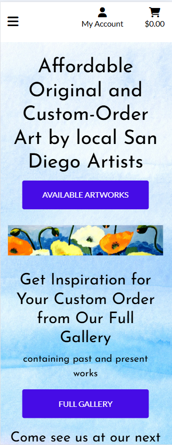

On small tablet:

On large tablet:

### Accessibility
Semantic HTML is used throughout the site for SEO purposes, to give context to screen readers, as well as to enable keyboard-only navigation as far as possible, with autofocus used for forms on the site. Each image has a descriptive alt attribute, all links are aria-labelled, and the contrast ratio is high across the site. 

- The site earns 100% for each of lighthouse's SEO and Accessibility categories.

## Search Engine Optimization (SEO) and Social Media Marketing
### Keywords
### Sitemap
### Robots.txt File
### Social Media Marketing
### Newletter Marketing
## Agile Methods and Tools
Agile methods were used throughout planning and development of the project. First, wireframes, an entity relationship diagram, and user stories were developed.
### GitHub project, user stories, issues, epics, milestones, MoSCoW labels, and kanban
 User stories were transferred from the original excel file to GitHub for tracking as follows: First create a project, [San Diego Art Outlet Project](https://github.com/users/ChristineEC/projects/6) and link it to the application's repository. Inside the respository, create an issue for each user story, connect it to the project, tag it with the relevant MOsCoW labels, and assign it to the ToDo column of the project's **kanban board**. Epics were also transferred from excel in the same way, with user stories linked to them as applicable. I made limited use of milestones in the earlier stages and middle stages of the project. At the end, I realized I had forgetten to set later milestones, such as for the Communications App, although many of those features were included in other Epics or Milestones. At the end ofthe project I found I had forgotten to link many activities to the milestones, though in general, the epics were linked. At the end, I created a few catch-all milestones for the final tasks and linked the tasks to those. During development, my kanban board had 5 columns: To Do, In Progress, In Styling, Done, Won't Do/Bugs. I deleted the In Styling column when it was no longer useful for better visibility of the other columns. I could have made better use of the milestones, as I never connected them to a timeline. In the future, I will surely do so, as I found myself adding certain functionalities (for artists) to the project before completing absolutely required features. On the other hand, I felt the artist-related functionalities were important for the overall purpose of and rationale for the site.
### Wireframes
Wireframes for the homepage, gallery (products) page, artwork detail and artists pages were completed prior to writing any html. While coding the first html files (homepage and gallery), I decided to slightly revise the wireframes to simplify the html code that would be needed and, more importantly, to make the wireframes more useful to me as visual aids while creating the html files. The homepage needed to be redesigned somewhat because the original design, in practice (I discovered), was not user-friendly: the 4 large images resulted in the user having to scroll to see the content lower on the page, even on a laptop, and the images might have been thought by the user to be clickable, as all other images on the website are. They simply took up too much real estate on the landing page, so they were replaced with a single image stretching across the page. The result was much more aesthetically pleasing and better suited to the purpose of the page.

Homepage large screens wireframe

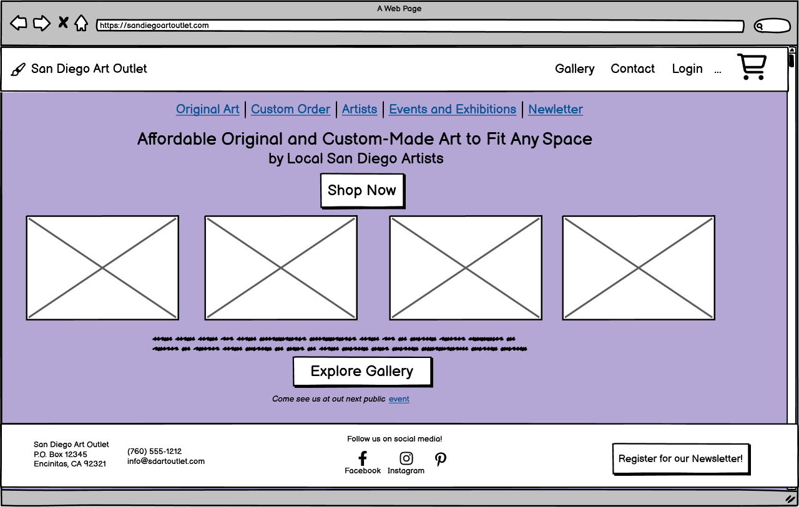

Homepage tablet wireframe

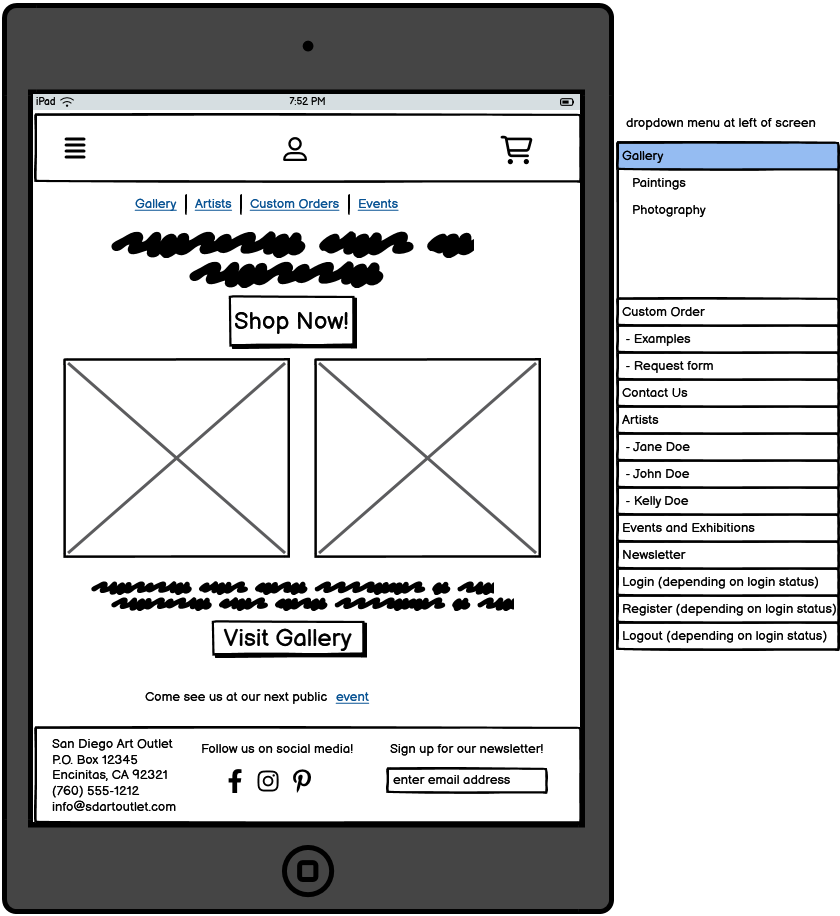

Homepage mobile wireframe

Gallery mobile wireframe

Artwork detail mobile wireframe

Artist page large screen wireframe

The final design for this page differs somewhat, as the logic involving the display of artists' works and the ability to place them in a shopping cart made it necessary. As with artworks in the shop or gallery, clicking on an artwork brings the user to an artwork detail page, where, if and only if an artwork has the status of "for-sale" will it appear with a button to add it to the shopping cart, otherwise, the user sees the button "back to gallery." This could be improved: users accessing a "sold" work from the gallery should see a button for "back to gallery", and users who access a "sold" work from the artist's page should see a button for "back to artist's page." Ideally, there would be both buttons (to gallery and to artist's page) in both scenarios, so this is an issue for future development.

### Entity Relationship Diagram
Following is the ERD used in development. Some models have additional or slightly fields now, but the relationships are the same between the models. The diagram does not include the Contact Us model, as I realized only later in development that it was crucial for good UX, so non-logged in users could send a message, as well as anyone not wanting to make a custom order inquiry, or an artist interested in contacting the group. That model does not connect to any other model. More detail about the data models can be found in the section about [Data Models](#data-models)

## Features and User Stories
### User Stories Table

| User Story | User Story Title | Fulfilling app or feature |
|------------|------------------|---------------------------|
| #1 | As a site visitor I can view a list of available art to see if there is something I want to purchase | Artworks app, Artworks page (Shop) |
| #3 | As a user I can easily access full product details, including price, artist, size, medium, etc., so that I can make an informed decision about whether to buy the item | Artwork detail page |
| #4 | A first time visitor can quickly determine the purpose and offerings of the site so they can decide if they want to explore further | Home app, Homepage |
| #5 | As a site visitor, I can sort the available art by medium so I can quickly find what I am looking for | Artworks app, Shop and Gallery pages, navbar |
| #7 | As a user, I can submit a custom order inquiry without submitting an order so that an artist can contact me later about my requirements | Communications App, Custom Order page and form, Admin |
| #9 | As a user I want to be able to add items to a shopping cart so that I can create a running list of things I want to buy before I proceed to checkout | Cart App |
| #12 | As a shopper I want to review the order information on the checkout page so I can ensure it is correct before making my purchase | Checkout App, checkout page |
| #13 | As a shopper I can review my shopping cart so that I can see which items I have added and what the current grand total is so I don't overspend | Cart App |
| #14 | As a shopper, I want to be able to delete items from my cart so that I can revise my order before purchasing | Cart App |
| #21 | As a site owner or artist, I can add, update and delete items for sale from the front end so that the inventory shown to users is accurate | Product Management Function, Artist's Page |
| #23 | As a site owner I can display information about the artists of the works for sale to drive user engagement and promote the artists | Artists page, Artist page(s) |
| #24 | As a site owner, I can display a custom 404 message so that my website maintains a professional look | Custom 404 page |
| #27 | (Future Feature) As a contributing artist I can update and delete my artist information on the front end so that I can optimize my artist page | Future Feature in Artworks App and Artist's page |
| #28 | As a user, I want to be able to see my current total at all times so I can stay within my budget or just easily keep track of my spending | Cart App |
| #31 | As a new user, I can create an account using my email and password so I can enjoy full site functionality | Login form (and real emails) |
| #32 | As a user I want to know that my account is secure and has been created so I can be sure that only I have access using my credentials | User Registration and real emails |
| #34 | As a logged-in user, I can save the information I enter during checkout to my account profile so that I don't have to re-enter my information each time I make a purchase | Profile App, checkbox on checkout page |
| #35 | As a user, I can update my account information so that it remains accurate | Profile App |
| #36 | As a user, I can enter my shipping and payment information so that I can complete my order | Checkout App |
| #37 | As a user I can receive an email confirmation of my completed order so I have a record of my purchase and order information | E-mail confirmations |
| #38 | (Future Enhancement) As an artist or site owner, I can create a custom order based on an online inquiry and make the product available only to a specific user for purchase online | Custom Order Inquiry, Artworks, and User models suitably related to provide future functionality (with probable addition of a CustomOrder model) |
| #41 | As a site owner, I can handle webhooks from Stripe to ensure that payment and order processes are fully handled | Checkout App |
| #44 | As a business owner, I want to be able to receive messages from customers or collaborators so I can respond as required by my business | Communications App, Contact Us nav and form, Admin |
| #45 | As a visitor to the site I can sign up for a newsletter so I can be aware of upcoming shows or other news | Newsletter signup in footer through MailChimp | 

### Homepage, Navigation and Footer
**User story 4: A first time visitor can quickly determine the purpose and offerings of the site so they can decide if they want to explore further**

**User story 45: As a visitor to the site I can sign up for a newsletter so I can be aware of the upcoming shows or other news**

The homepage is shown below. Prominent buttons for the shop and gallery, a shopping cart, a pretty piece of art, and the single headline and the clear nav items show the user at glance exactly what the site is for, with the subheading further emphasizing the site's possibilities. The nav elements that are expandable have small arrows to indicate that those menus are expandable. Without leaving the homepage, just by toggling the shop or gallery nav elements, the user can see what types of art are available.

Mobile Navigation dropdown from hamburger menu:

Mobile dropdown navigation:

Nav elements are different for logged in or non-logged-in users, and for superusers, as follows:

Not logged in: The My Account dropdown menu shows the options to register or login

Logged in user: The My Account dropdown menu shows the options **My Profile** and **Logout** (as in the image for the superuser, except without the Product Management option).

Superuser: In addition to the logged in user, the superuser sees **Product Management** in the dropdown menu under My Account.

The footer includes a MailChimp sign-up form for the newsletter, displayed prominently, as well as other links to actions the user might take, such as contacting the business or sending a custom-order request. The privacy policy and social media links are there as well, all three of which open in new tabs.

 
### Shop and Gallery
**User story 1: As a site visitor I can view a list of available art to see if there is something I want to purchase** 

The user who visits the shop page finds a list of all available artworks.

**User Story 5: As a site visitor, I can sort the available art by medium so I can quickly find what I am looking for**
The user can sort artworks even before they get to the shop or gallery or from inside the shop and gallery, as the navbar is visible all the same.
When the user chooses a medium, only artworks of that medium show in the shop until they choose a different medium, all artworks, or navigate away.

The gallery is nearly identical to the shop, except that users can also see works that have already been sold. This is designed to help them come up with ideas for custom orders.

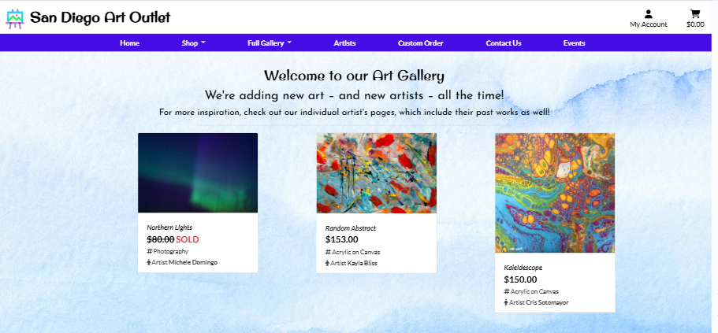

### Artwork detail page
**User story 3: As a user I can easily access full product details, including price, artist, size, medium, etc., so that I can make an informed decision about whether to buy the item**

In the shop or gallery, when a user hovers over a piece of artwork, that card gets a thick border (and jumps a bit) to indicate it is clickable. On the artwork detail page, users can see all relevant information about an artwork. 

No hover:

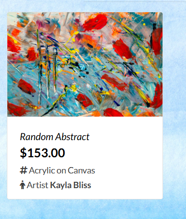

Hovered:

On the artwork detail page, the individual artwork that is *for sale* appears with a button to add it to the shopping cart and buttons to return to the shop or the gallery.

An artwork that is already *sold*, however, appears only with a button to return to the gallery (as the user will have come from there unless they came from the artist's page, but in any case, they won't have come from the shop, as no sold artworks appear in the shop).

Clicking on "view full image" opens the image in another tab so the user can get a good look at the piece.

### The Shopping Cart
**User story 7: As a user I want to be able to add items to a shopping cart so that I can create a running list of things I want to buy before I proceed to checkout**

The user is able to add an artwork to the shopping cart by clicking the Add to Cart button on the artwork detail page. When the user does this, they receive a pop up success message near the shopping cart icon containing the contents of their cart.

**User story 13: As a shopper I can review my shopping cart so that I can see which items I have added and what the current grand total is so I don't overspend**

The user can click the shopping cart icon from any page to review the contents of their cart.

**User story 14: As a shopper, I want to be able to delete items from my cart so that I can revise my order before purchasing**

The image above shows the delete link for items in a shopping cart. When a user clicks the link, the item is deleted from their cart, and they receive a success message and stay on the cart page to see what remains, if anything, with a button to return to the shop or go to secure checkout.

### Artists page
** User story 23: As a site owner I can display information about the artists of the works for sale to drive user engagement and promote the artists**

The artists page displays all artists with artworks on the site, with a photo of them, a short bio, and a link to their individual artist's page. Full bios appear on the individual **artists' pages**, described in the next subsection. The content for these pages is not yet fully developed but would be one of the first elements to enhance, both for SEO and user engagement. Each artist would be expected to provide a colorful, interesting bio to attract customers, as well as more photos of their past works, not to mention photos of their works hanging in actual homes.

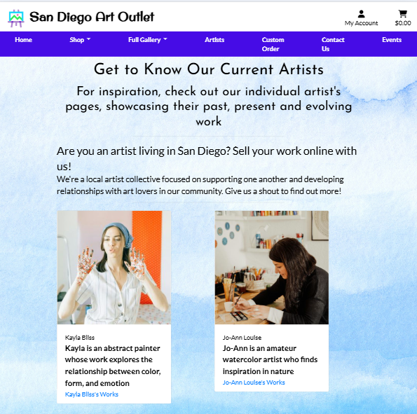

### Artists' pages
*User story 23, as above*
**User story 21: As a site owner or artist I can add, update and delete items for sale from the front end so that the inventory shown to users is accurate**

This user story is fulfilled in two ways: 1. for the artist, and 2. for the superuser. See also the [Product Management](#product-management-front-end) section below for more about superuser functionality.

Seen by the regular user, the artist's page simply displays the artist's works that have the status *for sale* or *sold*, as opposed to *pending*.

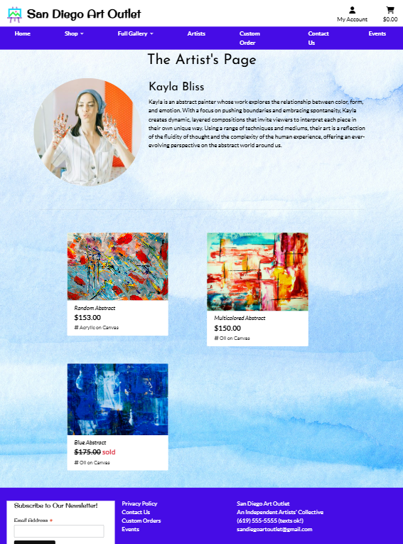

The artist's individual pages have the following functionality: 

An artist who has been *linked to a user account manually on the back end*, thus at the site owner's discretion, will see a link just under their bio for **adding** their artworks. The superuser sees the same. From the artist's page, no matter how they fill in the form (i.e., if they mistakenly choose another artist as artist), any artwork they add is added with the artist whose page it is as the *artist* of the artwork and as status *pending*, so that it won't appear immdediately on the site. This is so that the site owner has a chance to review the image and content and approve it before publication. On the same page, the site owner can simply update the artwork to change its status to *for sale* if they wish. (If the owner does not want to go through this extra step, they can use the Manage Artworks functionality that only they have access to, available in the dropdown menu under My Account. See the [Product Management](#product-management-front-end) section below for more on this.)

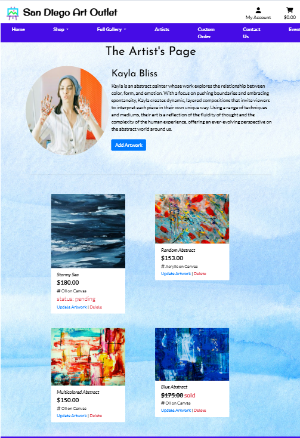

Clicking on the pending artwork to view its details brings the artist or superuser to the artwork detail page, where, instead of seeing the usual card containing the artwork details and buttons for adding to cart or returning to gallery or shop, they see the following message, designed to allow the artist or superuse to find the art they just added, even if they mistakenly entered the wrong artist (or simply forgot which artist it was). The link brings them to the artist's page where the artwork can be found.

The artist who tries to **update** an image receives an error message and is redirected back to the homepage. Future enhancement would involve sending the artist back to their own page.

An (authorized) artist can delete their own artwork from their artist page, but *only if that artwork's status is still pending*. Trying to delete an artwork with status *sold* or *for sale* results in an error message. This is to prevent artists from deleting objects related to already processed orders or users' shopping carts.

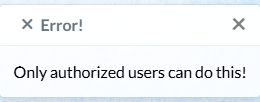

#### Customer View
The customer does not see any update or delete links and has no access to the product management menu.

#### Artist's view

The artist sees what the superuser sees on their own page only, allowing them to add artworks (with a status of pending only) and delete artworks only if they have a current status of pending. Otherwise they see what a normal user sees in the shop and gallery, with no access either to the product management menu. Attempting to update an artwork or delete an artwork that is *for sale* or *sold* gives the user an error message, as discussed in the section above under [Artist page and artists pages](#artists-page-and-artists-pages):

### Custom Order Request
**User story 7: As a user, I can submit a custom order inquiry without submitting an order so that an artist can contact me later about my requirements**

To send a custom order inquiry, the user has only to click on Custom Order in the navbar or in the footer. It was decided that only logged in users should be able to submit custom orders for several reasons: to prevent casual requests from users who are merely curious but not likely to follow through, and more importantly, to prevent the user typing in a wrong email and the business losing an opportunity. The user can still enter a different name and email, but on the back end the site owner can see which user sent the form, just in case. (Some users might prefer to use a different email in any case, such as when "asking for a friend".) It was also decided that the user, whether logged in or not, should be directed to a page containing the form (although the form is hidden for non-logged in users). This is so that more content can be added at a later date and to present the non-logged in user with the option to either log in or send a message through the contact form, which does not require logging in.

A user who is not logged in receives the following message, with an invitation to log in or send a message through the contact form (which does not require login):

**move this to future enhancements**
While the functionality of this page is acceptable, future enhancements would include more content and images both for SEO and to help users understand what the possibilities might be, such as custom art in the same price range as already available art (or even cheaper). This aspect of the site has good marketing potential that is not addressed at this stage of the project. Testimonials and wishlists are really needed to make this part of the project whole, as customers can be inspired by others and by their own "collections" in their wishlists. 

### Events page
### Newsletter signup
### Register
### Login and Logout
### Customer Profile page
#### Update profile form
### Product management, front end
**User story 21: As a site owner** (or artist, see above section for artist functionality) **I can add, update and delete items for sale from the front end so that the inventory shown to users is accurate**

Superusers can add, update, or delete any artwork from the front end as well as the back end. There is a form for **adding** new artwork, accessed from the Product Management menu item.

If the superuser saves an artwork with an image and a status of *for sale*, it is saved and the superuser is redirected to the artwork detail page and presented with a success message.

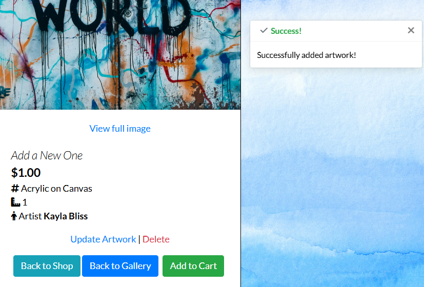

Attempting to add an artwork without an image results in the artwork being saved as "pending" so that it does not show up on the public site, even if the person adding it forgot to change the default status from "for sale" to "pending". Below is the message received by the superuser who has done so, having been redirected at the same time to the artist's page so they can continue working with the object.

The object can still be managed from the artist's page, and as soon as they include an image, the status can be easily changed from "pending" to "for sale" or "sold". Even if someone accidentally changes the status of an object with no image to "for sale" or "sold" on the back end, there is no way for a customer to add the object to their cart. 

Artwork can only be updated by the superuser by clicking the update artwork link whereever an artwork is displayed to the superuser.

The form is prefilled with the object's current data:

Successful update brings the user to the artwork detail page for that artwork.

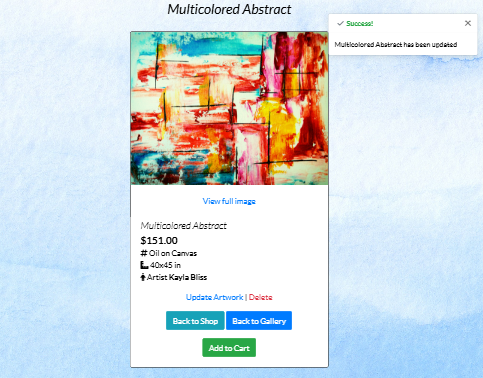

### Webhooks

## Data Models

Following is the ERD used in development. The Contact Us model does not appear here: it is a simple model with no relation to any other models.

**Write more about the data models here............................**

## Tools and Technologies Used

## Deployment

In Heroku, the following configuration variables are required:

- AWS_ACCESS_KEY_ID
- AWS_SECRET_KEY_ID
- DATABASE_URL
- EMAIL_HOST_PASS
- EMAIL_HOST_USER  (the email from which emails should be sent)
- SECRET_KEY (This is your secret key. Recommended to be different than the one you use in development.)
- STRIPE_PUBLIC_KEY
- STRIPE_SECRET_KEY
- STRIPE_WH_SECRET
- USE_AWS (Set equal to 1)

## Testing

## Future enhancements

## Bugs Fixed
- Links for the Account dropdown menu were invisible, except for the one with a currently valid href.
**Fix:** I removed the link to Bulma CSS files in the base.html, as it was not needed and was causing the error.

- The MEDIA_URL template tag was not working for files that were added manually to the project's media folder, such as the homepage images or the 'noimage.jpg' file, although it was working for images added to the media folder when objects with image attributes were added to the database (in development).
**Fix:** Added `django.template.context_processors.media` in the context_processors option of TEMPLATES in settings.py.

- Orders were being created in the database, but line items were not being added to the orders, so they were empty, although charges for the correct amounts were being processed. This led me to research my code involving the Order and OrderLineItem models and views.
**Fix:** I added one save method that I had accidentally left out (or possibly accidentally deleted) and revised the other in the Order and OrderLineItem models. I also fixed a typo where the line items were being summed in a method in the Order model.

- For the cancel button (an anchor tag styled as a button) on the artist's "add an artwork" form (as a non-superuser but as the artist of the artwork to be added), from the url `/artworks/artist_add_art/1/`, I was trying to inject the desired href for returning the artist-user to their page by using javascript to get the artist id from the url and set it in the href, but I struggled to get the link to work as expected, even though it looked fine in the rendered html. It would either add the contents of the href to the current url (for a path that didn't exist), or it would start the url with just the href (and not the preceding `/artworks/` needed). Even when I added in the preceding part of the url that was needed (or so I thought), it then added that on to the end of the `/artworks/artist_add_art/1/` url. Awaiting tutoring assistance, I discovered a solution that worked: hardcoding the href to `javascript:history.back(-1);`. It worked beautifully! However, as I was implementing that, I thought of one more thing to try that I have decided to implement as the fix:
**Fix:** The href needed to be set, not as `artist/${artistId}/` or `/artist/${artistId}/` or `artworks/artist/${artistId}/` but as `/artworks/artist/${artistId}/'. So much trouble over one little forward slash, but a worthwhile learning experience!

- Contact Us Form labels appeared above the input areas, despite having tried to remove the auto-generated labels. I was able to find a solution as follows in the django-crispy-forms documentation:
**Fix:** In the forms.py file include: from crispy_forms.helper import Form Helper, then assign the helper to the form object using `self.helper = FormHelper(self)`, then call the helper with the following: `self.helper.form_show_labels = False`

- Uploading json files to Postgres threw the following error: UnicodeDecodeError: 'utf-8' codec can't decode byte 0xff in position 0: invalid start byte
**Fix:** At the suggestion of Oisin at Code Institute's tutor support, I copied the content of my json files to new files and was able to upload them to the new database.

- I encountered a number of bugs with the site's images following implementation of AWS S3 storage of my static files and media. 
First, in development, the homepage static image was in my main static folder in an images subfolder. Although that image was copied over to AWS, it was still in a static/images folder and not being served on the deployed website, even though I added the image to my S3 bucket's media folder. I wasn't able to add the image to the media folder in VS code so that I could use the appropriate tag in `<filename.jpg>` index html that would work in both development and in deployment, either. When I came up with that idea, though, Rebecca at Code Institute told me I could manually add that to my media folder.
**Fix:** Add the jpeg file to my project's media folder in Windows, which was then reflected in my VS code, allowing me to use the `MEDIA_URL` tag in the html as I wanted.
Secondly, some of my artist's images were not showing up in the deployed version. Adding them to the database through the admin panel in the deployed version after having already copied the image files to my S3 bucket was causing the images to be renamed in Postgres on the fly, yet I couldn't see the new renamed images in the bucket, and they were still not being rendered.
**Fix:** Rename all artist images on my computer to artists' names for easier identification. On the development site, change the artist objects' images to the new images. Dump the Artist model data from mySQL local database into a new json file and upload to Postgres locally. At this point, Heroku threw an error upon redeployment, so I set an environment variable `COLLECTSTATIC = 1` on Heroku, deployed, then removed that environment variable. Redeployment after that worked fine, with all images being served from my S3 bucket. In future projects, I would choose not to have different databases in development and deployment but would, rather, use Postgres or other suitable relational database from the beginning.

## Credits
### Helpful people
Many, many thanks to my course facilitator at Code Institute, Kay Welfare, and my Code Institute mentor for this project, Juliia Konn! Thanks also to to Code Institute tutors Oisin, Sarah, Rebecca, Roman (and my apologies to any I may have missed).

### Code Institute
This project was developed based on Code Institute's Boutique Ado (BA) e-commerce walkthrough project. Some parts of the html and CSS of the present project--for example, the checkout, checkout_success and shopping cart pages--were heavily based on Boutique Ado, with only slight modifications for my own purposes. The navigation elements follow the BA example very closely, with only minor modifications . The UserProfile and Order models are nearly identical to those in BA; OrderLineItem, Artwork (products), and Medium (category) models are also very closely modeled on BA. The coding for the Stripe functionality relies heavily on BA, including webhooks and webhook handlers.

### Image credits
Many thanks to [Pexels](https://www.pexels.com/), from which most images were sourced.
Specific credits for each image from Pexels follow.
Photos for the artists:
- [Photo by Aleaid Kozik](https://www.pexels.com/photo/a-woman-watercolor-painting-7181853/)
- [Photo by Nataliya Vaitkevic]( https://www.pexels.com/photo/a-woman-with-paint-on-her-hands-5641812/)
- [Photo by Matheus Bertelli](https://www.pexels.com/photo/silhouette-of-woman-photographer-using-camera-at-night-2376991/)
- [Photo by Mikhail Nilov](https://www.pexels.com/photo/woman-in-green-long-sleeve-shirt-holding-white-printer-paper-6932520/)
Photos for artworks:
- [Photo by Efrem  Efre](https://www.pexels.com/photo/northern-lights-27734078/)
- [Photo by Steve Johnson](https://www.pexels.com/photo/multicolored-abstract-painting-1266808/)
- [Photo by Steve Johnson](https://www.pexels.com/photo/multicolored-abstract-painting-1266808/)
- [Photo by Steve Johnson](https://www.pexels.com/photo/multicolored-abstract-painting-1269968/)
- [Photo by Steve Johnson](https://www.pexels.com/photo/photo-of-blue-abstract-painting-2123666/)
- [Photo by Dan Cristian Pădureț](https://www.pexels.com/photo/photo-of-multicolored-abstract-painting-1193743/)
- [Photo by Zaksheuskaya](https://www.pexels.com/photo/teal-white-and-pink-paint-1561020/)
- [Photo by Steve Johnson](https://www.pexels.com/photo/photo-of-abstract-painting-on-canvas-1626364/)
- [Photo by Steve Johnson](https://www.pexels.com/photo/multicolored-abstract-painting-1787242/)
- [Photo by Steve Johnson](https://www.pexels.com/photo/multicolored-abstract-painting-1856456/)
- [Photo by Steve Johnson](https://www.pexels.com/photo/multicolored-abstract-painting-1856455/)
- [Photo by Steve Johnson](https://www.pexels.com/photo/photo-of-abstract-painting-1843716/)
- [Photo by Steve Johnson](https://www.pexels.com/photo/multicolored-abstract-painting-1985682/)
- [Photo by Steve Johnson](https://www.pexels.com/photo/red-and-yellow-floral-textile-1787243/)
- [Photo by Steve Johnson](https://www.pexels.com/photo/photo-of-blue-abstract-painting-2123667/)
- [Photo by Steve Johnson](https://www.pexels.com/photo/multicolored-abstract-painting-1985664/)
- [Photo by Steve Johnson](https://www.pexels.com/photo/multicolored-abstract-painting-2085588/)
- [Photo by Quang Nguyen Vinh](https://www.pexels.com/photo/landscape-mountains-nature-water-6348018/)
- [Photo by Marek Piwnicki](https://www.pexels.com/photo/white-smoke-in-grayscale-photography-11032516/)
- [Photo by Niklas Jeromin](https://www.pexels.com/photo/a-close-up-of-a-blurry-christmas-tree-19562594/)
- [Photo by Marek Piwnicki](https://www.pexels.com/photo/white-smoke-in-dark-room-13327735/)
- [Photo by Marek Piwnicki](https://www.pexels.com/photo/ghost-15499506/)
- [Photo by ClickerHappy from Pexels](https://www.pexels.com/photo/calm-clouds-fountain-garden-407083/)
- [Photo by Landiva Weber from Pexels](https://www.pexels.com/photo/a-close-up-of-a-green-and-pink-swirl-27376167/)
Artworks images sourced from [Pixabay](https://pixabay.com/):
- [Image by Lily DuVeau](https://pixabay.com/users/lilyduveau-4987876/?utm_source=link-attribution&utm_medium=referral&utm_campaign=image&utm_content=2290711) from [Pixabay](https://pixabay.com//?utm_source=link-attribution&utm_medium=referral&utm_campaign=image&utm_content=2290711)
- [Image by Juanita Mulder](https://pixabay.com/users/agnali-3087927/?utm_source=link-attribution&utm_medium=referral&utm_campaign=image&utm_content=1750014) from [Pixabay](https://pixabay.com//?utm_source=link-attribution&utm_medium=referral&utm_campaign=image&utm_content=1750014)
- [Image by Lily DuVeau](https://pixabay.com/users/lilyduveau-4987876/?utm_source=link-attribution&utm_medium=referral&utm_campaign=image&utm_content=2290713) from [Pixabay](https://pixabay.com//?utm_source=link-attribution&utm_medium=referral&utm_campaign=image&utm_content=2290713)
- [Image by Supichaya Sookprasert](https://pixabay.com/users/neangart-16005384/?utm_source=link-attribution&utm_medium=referral&utm_campaign=image&utm_content=5062356) from [Pixabay](https://pixabay.com//?utm_source=link-attribution&utm_medium=referral&utm_campaign=image&utm_content=5062356)

