# SEO and Web Marketing

## Keywords Research
Initial brainstorming included the following words and phrases for short-tail and long-tail keywords:

| short-tail | long-tail |
|------------|-----------|
| art | art near me |
| local art | local artists selling online |
| cheap art | buy local art |
| huge paintings | custom wall art |
| photography | cheap art for big spaces |
| art outlet | inexpensive abstract paintings |
| art online | San Diego artists |
| wall decor | real art cheap near me |
| paintings online | online art outlet |
| inexpensive art | affordable online art San Diego |
| buy astrophotography | buy art online near me |
| poured-paint art | local art events San Diego |
| psychedelic art | psychedelic artists San Diego |
| watercolor paintings | buy large watercolor painting near me |
| nature photography | nature photography for sale near me |
| buy art | California artists online |
| home decor | inexpensive art near me |
| original art | custom-made art San Diego |
| custom art | local art exhibitions |
| abstract painting | help with bare walls |
| affordable art | affordable art for the home |
| California art | Southern California art scene |
| original art | online original art by local artists |
| cool art | buy original art by local artists |
| big art | see original art by local artists |
| huge art | buy original artworks for the home cheap |
| large art | San Diego artists selling online |
|  | real art for cheap near me |
|  | find a local artist to make me a big piece of art for a large space |

I first researched these terms by entering them in Google Search to see what other searches were made similar to these. Some screenshots:

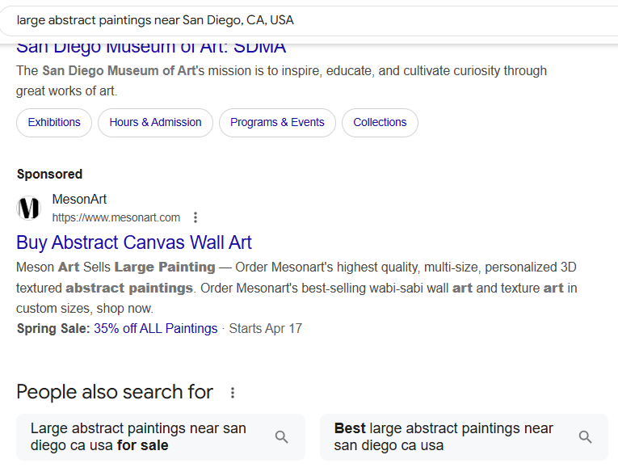

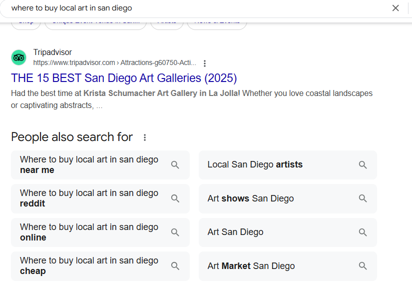

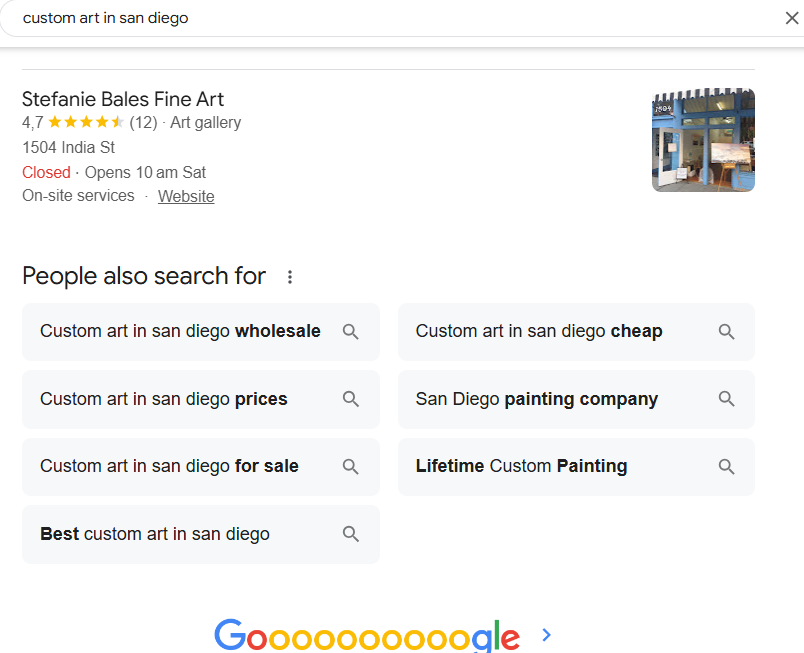

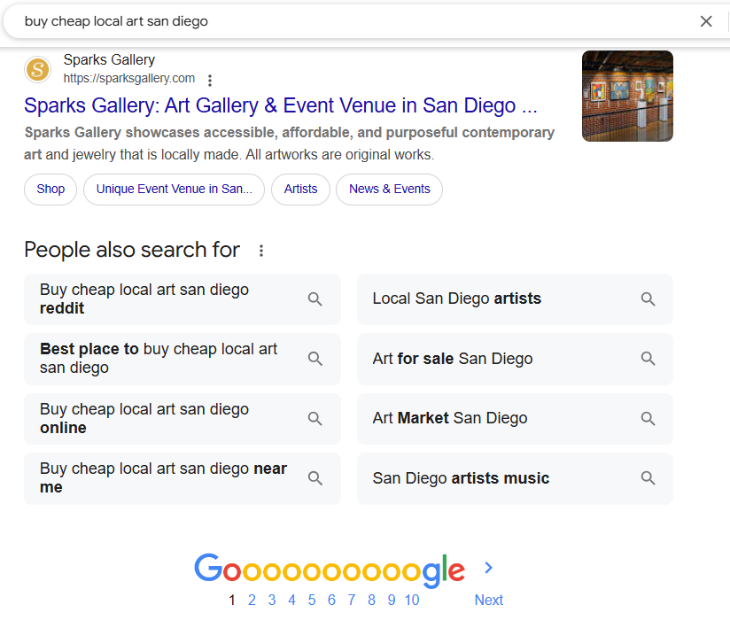

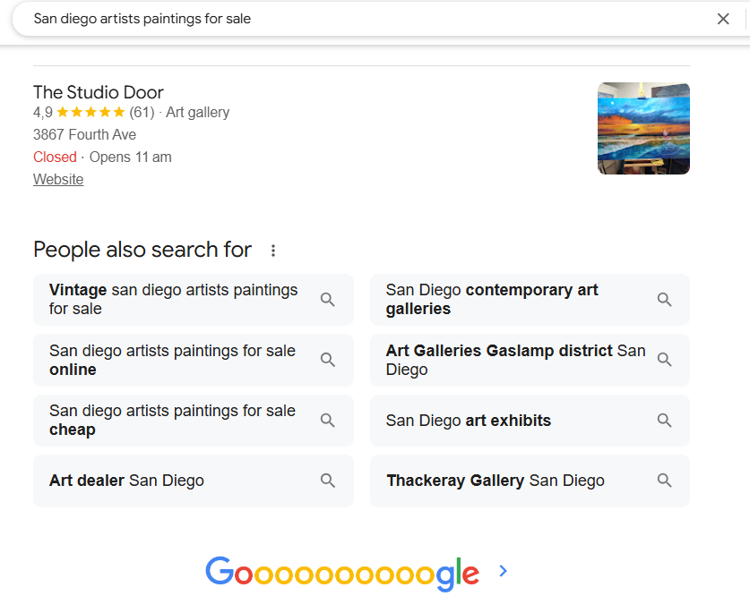

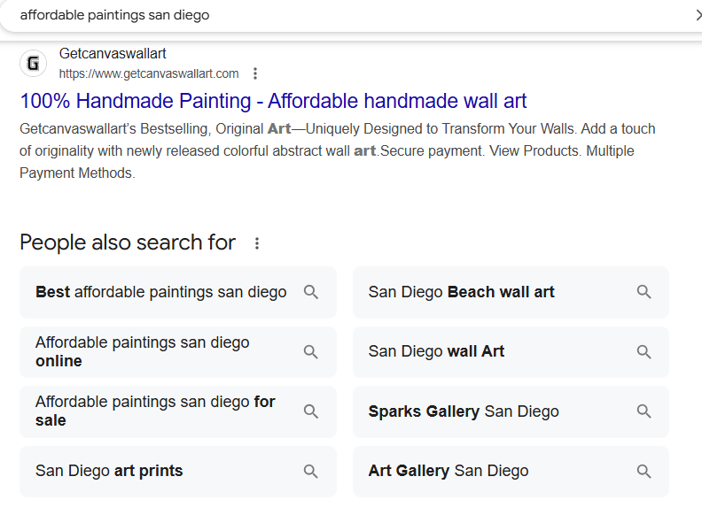

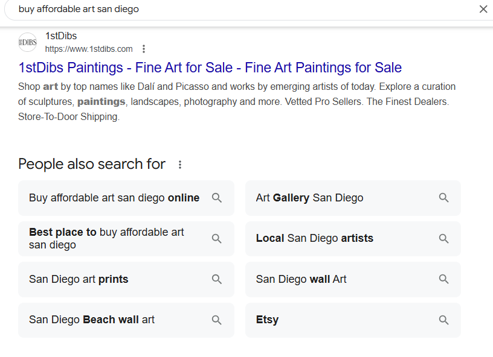

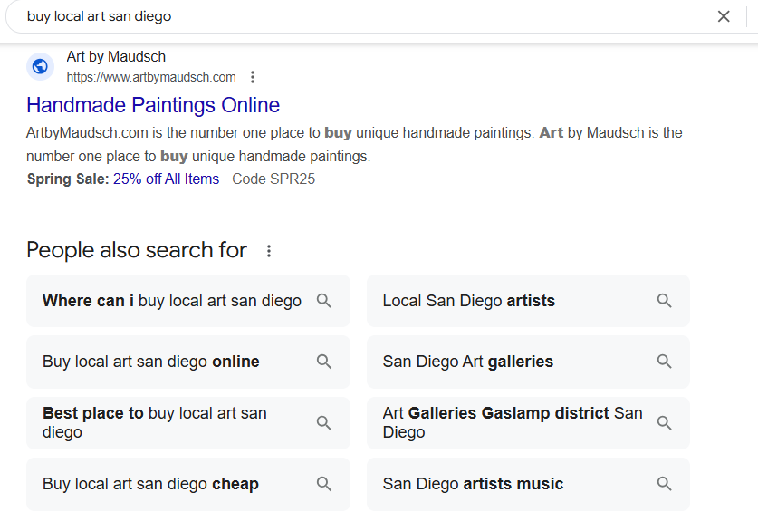

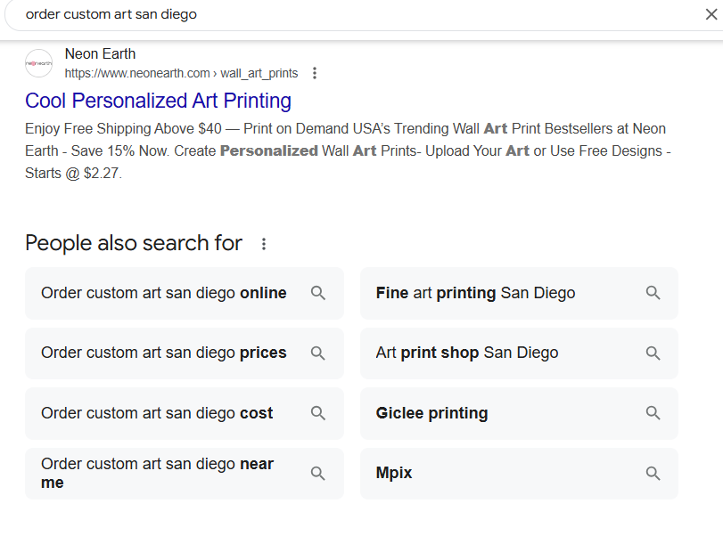

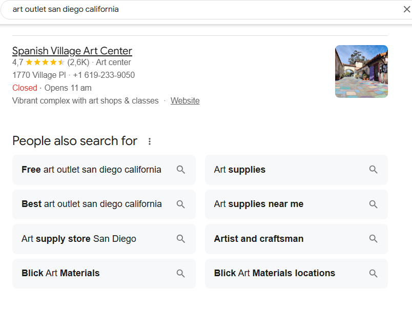

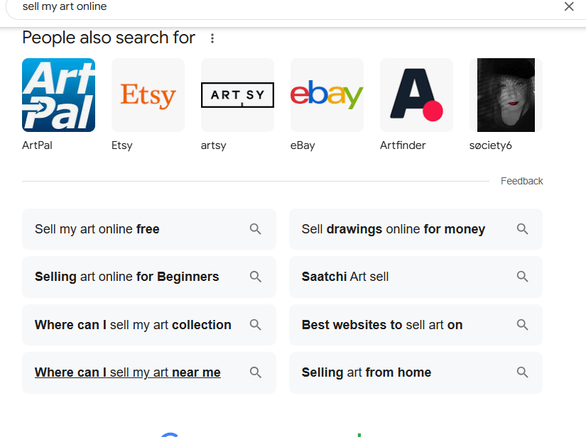

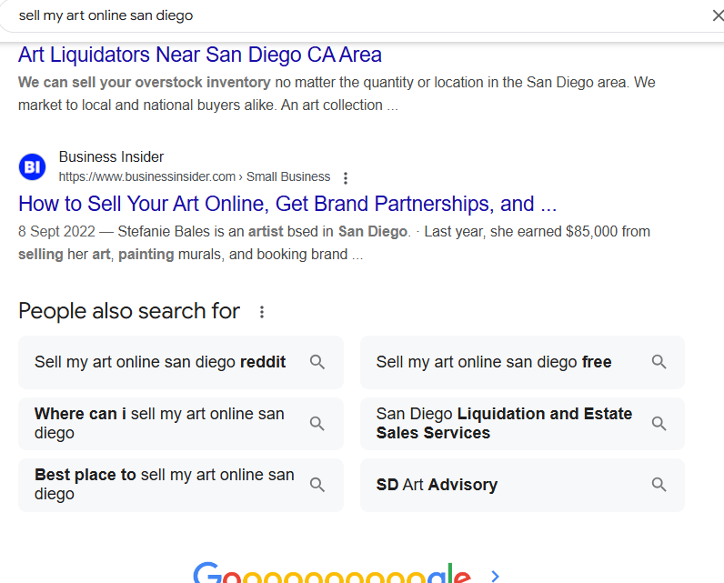

I also started using Web Tracker and spent some time looking at each result, looking for those that were relevant in terms of high volume combined with lower competition, but I was locked out more quickly than I thought I would be, so I didn't get any screenshots of those results.

In the end, I chose the following keywords:

- Short-tail (7): affordable art, abstract paintings, watercolor
      paintings, buy astrophotography, psychedelic art, custom wall-art,
       art outlet
- Long-tail (8): San Diego artists, affordable local art, San Diego artists collective,
      buy local art, cheap art for big spaces, san diego art outlet, buy local original art, custom-order art San Diego

I'm not convince the short-tail keywords are the best that could be used, and further enhancement of the project would certainly involve using a paid service to improve these.
      

## Research of Similar Businesses
I had a look at Etsy, just to see if I could narrow down results so the experience was less overwhelming, without success. The site is way too big for the kind of customer targeted by San Diego Art Outlet, although I suppose individual artists who market for themselves can link to their works on the site. The site is impersonal and quite "corporate"--the exact opposite vibe from what San Diego Art Outlet is going for. A search on Etsy for local San Diego art yields mostly prints and posters of art--not the actual original art itself. San Diego Art Outlet is for the customer who wants an actual piece of original art for their home. Happily, the pricing of San Diego Art Outlet is competitive with Etsy.

[Sparks Gallery](#https://sparksgallery.com/), an in-person and online shop in San Diego featuring local artists would be an excellent source of inspiration for further development of the site. Their "lookbook," or full gallery, shows the art in situ, which will be important for future development, and the site also has images of actual people enjoying art at an art event, which the current version of San Diego Art Outlet lacks. I note that promotion of events is also prominent on their site.

## SEO Improvements

The following SEO-related meta tags have been used in my base.html header to promote SEO:

`<meta name="description" content="San Diego artists offer affordable
      original and custom-made art online, including watercolor,
      oil, and acrylic paintings and stunning photography.">`

`<meta name="keywords" content="affordable local art, San Diego artists collective,
      buy local art, cheap art for big spaces, psychedelic art, custom wall-art,
      San Diego artists, art outlet, san diego art outlet, abstract paintings, watercolor
      paintings, buy astrophotography, affordable art, buy local original art,
      custom-order art San Diego">`

In addition, I have included **sitemap.xml** and **robots.txt** files in my project code. I added the google-sites-verification meta tag to my base.html as well.

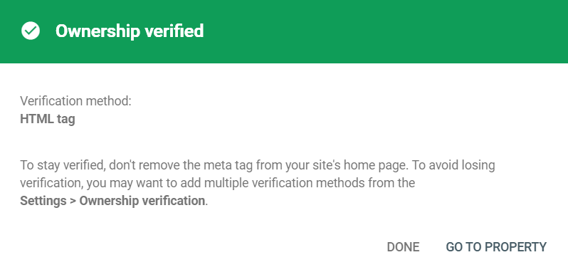

The links to social media--Facebook and Instagram--include the relative attribute "nofollow."

A privacy policy is also readily available through a link in the site's footer, which opens in a separate tag. The policy was generated by [Privacy Policy Generator](https://www.privacypolicygenerator.info/).

## Web Marketing Strategies
A facebook page is a necessity for an e-commerce site like San Diego Art Outlet because its target audience (ages 28-65, roughly) is extremely likely to use Facebook, and Facebook is often where this audience turns for news from their friends and community about goings on about town or local offerings. Facebook is highly visual, as is the product of San Diego Art Outlet. On Facebook the business, with the permission of customers, of course, can post images of the art in-situ--that is, hanging on people's walls--whereas customers might not feel comfortable having their homes appear in images on a more "permanent" website like the business's website.

Even before the website undergoes further development for likes, wishlists, and testimonials, all of these aspects of customer engagement are immediately available through Facebook.

Here are the images of the site created:

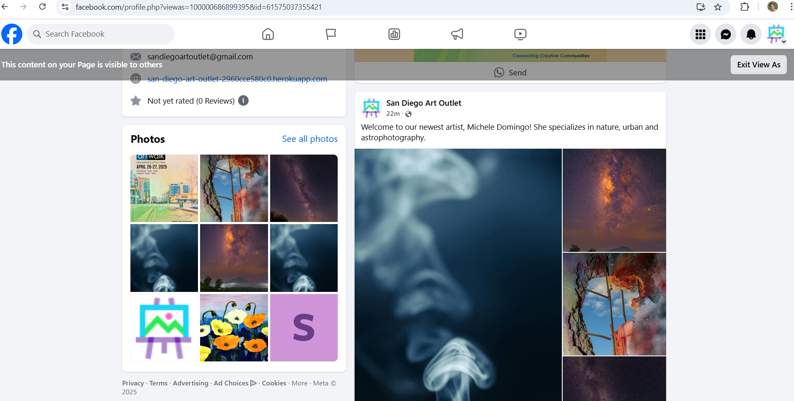

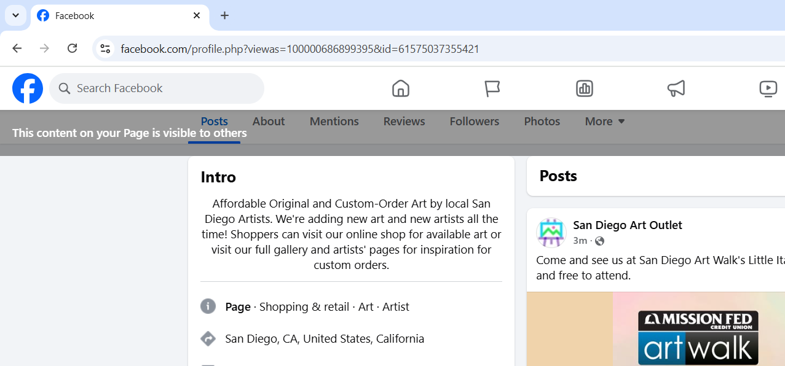

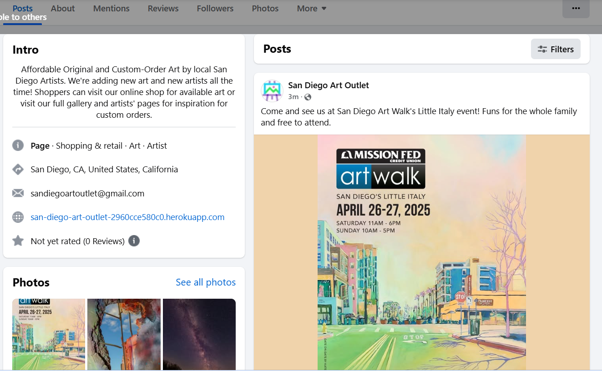

Unfortunately, I am unable to include a link because I thought the option to "deactivate" meant just "unpublish" before it was too late and I'd lost the whole page. In any case, it was likely to be taken down quickly, as it was linked to my personal account, and I am in Europe, while the site is for an online shop in San Diego (with no real address listed and no phone number).

Instagram would be another important option for this business.

For email marketing, I had originally set up a model in django to collect newsletter signups, but I decided that for a small business like San Diego Art Outlet, the free MailChimp was a much better option for the site owner, as free marketing campaigns could be most conveniently run from there. Thus, the MailChimp newsletter signup form is prominently displayed in the footer on all pages, and has been tested and verified to work as expected each time. There are now 5 people signed up, including the business owner and myself (privately), plus a few of my siblings and my Code Institute mentor. I will not show those addresses here, but rather the MailChimp summary:

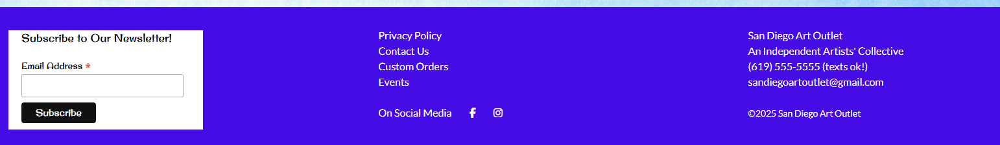

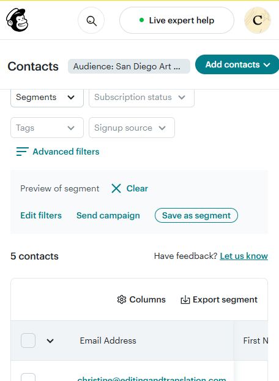

## Other Marketing Strategies
This business would benefit from in-person presence at art festivals and street fairs in San Diego, which are extremely common and occur year-round. Facebook, Instagram and the Newsletter are perfect vehicles for getting the word out about these events. People are more likely to buy art when they have met the artist. In addition, the business would help artists get their works shown in local cafes, restaurants, bars, and other public spaces.
