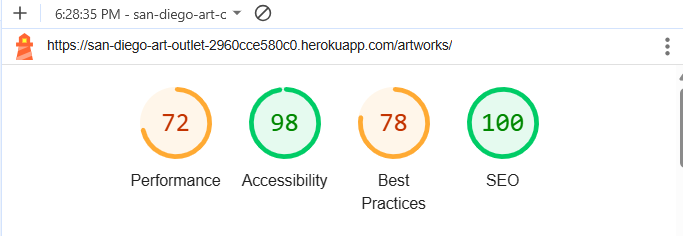
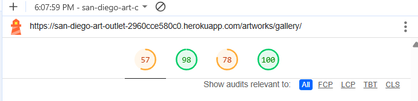
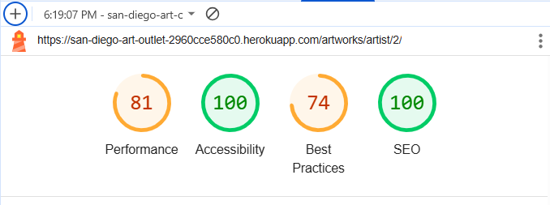

# Testing Procedures and Results

## Table of Contents
1. [Validation](#validation)
    - [Python](#python)
    - [CSS](#css)
    - [JavaScript](#javascript)
    - [HTML](#html)
2. [Responsiveness](#responsiveness)
3. [Lighthouse Results](#lighthouse-results)
4. [Browser Compatibility](#browser-compatibility)
5. [Manual Testing](#manual-testing)
    - [Table 1. User Stories](#table-1-user-stories)
    - [Table 2. Actions, Expected Results, and Outcomes](#table-2-actions-expected-results-and-outcomes)
        - [First-time visitor or user who has never registered for an account](#first-time-visitor-or-user-who-has-never-registered-for-an-account)
        - [Logged in Users](#logged-in-users)
        - [The Superuser](#the-superuser)
        - [An artist who has a (normal) user account and who has been added to their Artist object (Artist.user) as the "user" on the backend by the superuser](#an-artist-who-has-a-normal-user-account-and-who-has-been-added-to-their-artist-object-artistuser-as-the-user-on-the-backend-by-the-superuser)
## Validation
### Python
Python files were tested using flake8 in VS Code. The results are as follows, with 6 lines raising issues:

All six lines will be ignored: 
- Signals are being used in checkout/apps.py and must be registered there in order for the user to be able to save their delivery address to their profile by checking the checkbox on the checkout page. 
- The next four lines are for too-long lines of code in settings.py, but experimenting with breaking up those lines resulted in errors, so it is best to leave those, as they are generated by django.
- The handler404 is indeed being used to enable the custom 404 error message in deployment.

Thus there are no python files that need fixing.
### CSS
The following CSS files comprising all of the CSS files I created were validated using the [WC3 CSS Validator](https://jigsaw.w3.org/css-validator/):

- artworks.css

- checkout.css

- base.css

- profile.css

All passed with no errors or warnings.
### JavaScript
All of the JavaScript files of the project were run through JSHint.

| file | results | comment |
|------|---------|---------|
| artists.js | no errors or warnings | |
| stripe_elements.js | unrecognized variable Stripe | This was expected and is needed for Stripe functionality in the project |
| countryfields.js | warning of unnecessary semicolon | ignored because the linter also didn't recognize the $ symbol being used in the code, and the semicolon was in the correct place and necessary |
### HTML
HTML validation was carried out through direct input of rendered html using [W3C Vaidation Service](https://validator.w3.org/). Results are as follows, with no remaining issues to be fixed.

| file | results | comment |
|------|---------|---------|
| base.html | no errors or warnings | indirectly checked as part of other pages |
| index.html | no errors or warnings |  |
| shop.html | no errors or warnings  |  |
| add_artwork.html | no errors or warnings |  |
| artist_add_art.html | no errors or warnings |  |
| artist.html | one warning: Article lacks heading | This warning will be ignored for layout purposes. One article tag now wraps an h2 and a second article element--the one that raises this warning. The inner article element will be preserved so that a future change of the artist bio field in the model from textfield to summernote field will not raise errors, as it would if I used a paragraph element here instead of the inner acticle element. Summernote fields are rendered as paragraphs, so an article (or other) tag is needed to contain them. |
| artists.html | no errors or warnings |  |
| artwork_detail.html | no errors or warnings |  |
| gallery.html | no errors or warnings |  |
| update_artwork.html | no errors or warnings |  |
| artwork_image.html |  | This cannot be tested directly but is tested in the fully rendered cart.html page, of which it is an included html |
| artwork_info.html |  | included in cart.html |
| artwork_price.html |  | included in cart.html |
| cart.html | no errors or warnings |  |
| delete_from_cart.html |  | included in cart.html |
| checkout_success.html | no errors or warnings |  |
| checkout.html | warning: empty heading | This refers to an h1 that contains the spinner icon that is activated after the user clicks "complete order", so the h1 is not actually empty; its content is simply not displayed until and unless necessary. |
| contact_us.html | no errors or warnings |  |
| custom-request.html | no warnings or errors |  |
| events.html | no errors or warnings |  |
| profile.html | no errors or warnings |  |
| Login, Logout, Register, amd Reset Password pages (inheriting from allauth/account/base.html) | no errors or warnings |  |
## Responsiveness
The website is fully responsive on all viewports, from mobile through desktop size.

On desktop:

On Laptop:

On small mobile:

On small tablet:

On large tablet:

## Lighthouse Results
- Homepage

- Shop

Before fixing cache policy in settings.py:

After fixing cache policy:

    - Shop sorted by acrylic paintings

- Gallery

The initial gallery score was unacceptably low for performance:

One of the messages had to do with the caching policy. I went and checked my settings.py, as I knew I had set a caching policy there for objects in my AWS S3 bucket, and discovered I had left off a needed comma in the code. After fixing that, the performance score doubled. Other issues are discussed at the end of this section.

- Artists page

- Artist's page

Before fixing the cache-policy setting (as mentioned above), the score was the artist's page was also low for performance.

The fixed cache policy resulted in a higher performance score:

- Contact Us page

- Custom Order Request page

Some of the details from the above results:

It seems clear from the results of the gallery page that better image handling is necessary. This page has the most artworks and contains a lot of photography as well. One lighthouse suggestion is to delay rendering of off-screen images, and it would be a good idea to implement pages here, rather than infinite scroll, especially for the gallery but even for the shop.

The best practices score is consistent throughout and is mainly due to the implementation of Stripe.

Serving images in next-gen formats is also something I would look into. I believe Cloudinary may have been a better choice for this app, as it seems more user friendly, and I know there are easy ways to work with the images to serve them dynamically at the sizes required while they are being served.

One issue that deserves attention is shown in the second-to-last image here and concerns security. In the project's present iteration, this is not serious, as no real purchases are being made, but if one wanted to go live with the project (in terms of Stripe--not just in test mode), this would be an issue to understand and address in advance.
## Browser Compatibility
The website was tested in the following browsers, with no known compatibility issues:
| Browser | Compatible |
|---------|------------|
| Chrome | &#9989; |
| Mozilla Firefox | &#9989; |
| Opera | &#9989; |
| Safari | Unable to access the webpage |
| Edge | &#9989; |
| IOS (on an iPhone in Chrome browser) | &#9989; |
| Android phones | &#9989; |

There are known issues with Heroku and Safari, but at this stage I have not addressed them, so the website is not accessible in Safari at the moment. No errors are raised--I just can't get the page to load at all.

## Manual Testing
Extensive manual testing of user stories and all interactive functionality has been completed, with no remaining bugs or errors and all required user stories fulfilled.

User stories and the outcome of various user interactions with regard to them are discussed extensively in the [README.md](README.md) file in the section under Features and User Stories. Therefore, they will be summarized here in a table, followed by a table showing action, expected results, and outcomes.
### Table 1. User Stories
| User Story | User Story Title | Fulfilling app or feature | Pass |
|------------|------------------|---------------------------|------------------|
| #1 | As a site visitor I can view a list of available art to see if there is something I want to purchase | Artworks app, Shop page | &#9989; |
| #3 | As a user I can easily access full product details, including price, artist, size, medium, etc., so that I can make an informed decision about whether to buy the item | Artwork detail page | &#9989; |
| #4 | A first time visitor can quickly determine the purpose and offerings of the site so they can decide if they want to explore further | Home app, Homepage | &#9989; |
| #5 | As a site visitor, I can sort the available art by medium so I can quickly find what I am looking for | Artworks app, Shop and Gallery pages, navbar | &#9989; |
| #7 | As a user, I can submit a custom order inquiry without submitting an order so that an artist can contact me later about my requirements | Communications App, Custom Order page and form, Admin | &#9989; |
| #9 | As a user I want to be able to add items to a shopping cart so that I can create a running list of things I want to buy before I proceed to checkout | Cart App | &#9989; |
| #12 | As a shopper I want to review the order information on the checkout page so I can ensure it is correct before making my purchase | Checkout App, checkout page | &#9989; |
| #13 | As a shopper I can review my shopping cart so that I can see which items I have added and what the current grand total is so I don't overspend | Cart App | &#9989; |
| #14 | As a shopper, I want to be able to delete items from my cart so that I can revise my order before purchasing | Cart App | &#9989; |
| #21 | As a site owner or artist, I can add, update and delete items for sale from the front end so that the inventory shown to users is accurate | Product Management Function, Artist's Page | &#9989; |
| #23 | As a site owner I can display information about the artists of the works for sale to drive user engagement and promote the artists | Artists page, Artists' pages | &#9989; |
| #24 | As a site owner, I can display a custom 404 message so that my website maintains a professional look | Custom 404 page | &#9989; |
| #27 | (Future Feature) As a contributing artist I can update and delete my artist information on the front end so that I can optimize my artist page | Future Feature in Artworks App and Artist's page | &#9989; |
| #28 | As a user, I want to be able to see my current total at all times so I can stay within my budget or just easily keep track of my spending | Cart App, Navbar | &#9989; |
| #31 | As a new user, I can create an account using my email and password so I can enjoy full site functionality | Login form (and real emails) | &#9989; |
| #32 | As a user I want to know that my account is secure and has been created so I can be sure that only I have access using my credentials | User Registration and real emails | &#9989; |
| #34 | As a logged-in user, I can save the information I enter during checkout to my account profile so that I don't have to re-enter my information each time I make a purchase | Profile App, checkbox on checkout page | &#9989; |
| #35 | As a user, I can update my account information so that it remains accurate | Profile App | &#9989; |
| #36 | As a user, I can enter my shipping and payment information so that I can complete my order | Checkout App | &#9989; |
| #37 | As a user I can receive an email confirmation of my completed order so I have a record of my purchase and order information | E-mail confirmations | &#9989; |
| #38 | As an artist or site owner, I can create a custom order based on an online inquiry and make the product available only to a specific user for purchase online | Custom Order Inquiry, Artworks, and User models suitably related to provide future functionality  | Future Enhancement |
| #41 | As a site owner, I can handle webhooks from Stripe to ensure that payment and order processes are fully handled | Checkout App | &#9989; |
| #44 | As a business owner, I want to be able to receive messages from customers or collaborators so I can respond as required by my business | Communications App, Contact Us nav and form, Admin | &#9989; |
| #45 | As a visitor to the site I can sign up for a newsletter so I can be aware of upcoming shows or other news | Newsletter signup in footer through MailChimp | &#9989; |
### Table 2: Actions, Expected Results, and Outcomes
#### First-time visitor or user who has never registered for an account
- Please note that "as expected" in the Outcome column in the table below means that the description of the outcome is exactly the same as the description of the expected result. Only outcomes that need further description contain additional text, and additional text, rather than "as expected", should not be construed as meaning that the outcome was not as expected. The pass mark means that the expected result was achieved.

* Actions that can be performed by logged-in or non-logged-in users are shown in this firt section.

| Action | Expected Result | Outcome | Pass |
|--------|-----------------|---------|------|
| Navigate to site | Homepage (index.html) displays | as expected | &#9989; |
| Click on Available Artworks button | User sent to Shop | as expected |  &#9989; |
| Click on Shop in the navbar | User sent to Shop | as expected |  &#9989; |
| Click on Full Gallery button | User sent to Gallery | as expected |  &#9989; |
| Click on Full Gallery in the navbar | User sent to Gallery | as expected |  &#9989; |
| Click on Artists in the navbar | User sent to artists page displaying all artists | as expected |  &#9989; |
| Click on Custom Order page | User sees message that they need to be logged in to send a custom order but that they can send a message through the contact us form. The custom-request-form is not rendered in the html. See links to contact form and to login. | as expected | &#9989; |
| Click on Contact Us in the navbar | User sent to contact_us page displaying the contact form | as expected |  &#9989; |
| User enters information in contact form with correct data | Form is sent to back end and user receives a success message | as expected | &#9989; |
| User enters information in contact form with invalid data, such as an invalid email address | User receives messages onscreen to correct data before the form can be submitted. Note, this was fixed during testing. Phone number field changed to charfield to prevent 500 errors, as user was able to end a too-long number that caused an error. A charfield is preferred here so users can enter even extension numbers with their telephone numbers, which many people have at their offices, for example. | as expected | &#9989; |
| Click on Events in navbar | User is directed to events page | as expected | &#9989; |
| User clicks on MyAccount in the navbar | User is presented with two options: Register or Login | as expected | &#9989; |
| User clicks on Login | User brought to Sign In page and presented with Sign-in form and a link to Sign Up first | as expected | &#9989; |
| User with no account fills in Login form | User receives message that the username and password are not correct and is given the option (and a link) to sign up if they don't have an account yet | as expected | &#9989; |
| User clicks on Register | User sent to Sign Up form page | as expected | &#9989; |
| User fills in Sign Up form with invalid data | Built-in form validation prevents submitting the form and tells the user what needs to be fixed before the form can be validated | as expected | &#9989; |
| User fills in Sign Up form with valid data | User receives an email at the address they entered and a success message onscreen that a confirmation email has been sent in order for them to validate their account | as expected | &#9989; |
| User clicks on the email they receive to validate their signup | User is brought to the Confirm Email Address page to confirm their email address | as expected | &#9989; |
| User clicks Confirm on the Confirm Email Address page | <ol><li>User account is confirmed on the backend, with email address for the user registered and validated</li><li>User receives an onscreen success message that they have confirmed their email and they are directed back to the Sign In page and presented with the Sign In form</li><li>A user profile is created and is accessible on the back end</li></ol> | <ol><li>as expected</li><li>as expected</li><li>as expected</li></ol> | <ol><li>&#9989;</li><li>&#9989;</li><li>&#9989;</li></ol> |
| User fills in the newsletter signup form in the footer | <ol><li>User receives a sucess message onscreen that they are signed up</li><li>MailChimp records the email in the list of registered emails</li></ol> | <ol><li>as expected</li><li>as expected</li></ol> | <ol><li>&#9989;</li><li>&#9989;</li></ol> |
| User fills in newsletter signup form with an invalid email | Built-in validation informs the user of the error and allows them to fix it so they can submit | as expected |  &#9989; |
| User clicks on Privacy Policy (in footer) | Privacy policy is displayed in a new tab | as expected | &#9989; |
| User clicks on Facebook icon (in footer) | Facebook opens in a new tab | as expected | &#9989; |
| User clicks on Instagram icon (in footer) | Instagram opens in a new tab | as expected | &#9989; |
| User clicks on Contact Us link in the footer | User directed to Contact form | as expected | &#9989; |
| User clicks on Events link in the footer | User directed to Events page | as expected | &#9989; |
| On events page, user clicks on an event with an image (flyer) | A new tab is opened in the browser displaying the image (flyer) | as expected | &#9989; |
| On events page, user clicks on an event with no image (flyer) | No action | as expected | &#9989; |
| User clicks on Events link on the homepage | User directed to Events page | as expected | &#9989; |
| User clicks on the Shop dropdown menu in the main nav | All dropdown menu choices are shown (i.e., sorting art by medium) | as expected | &#9989; |
| User clicks on any of the Shop dropdown menu items | User is directed to Shop, where only the artworks of the appropriate medium or shown | as expected | &#9989; |
| User visits the Shop | User sees all (and only those) artworks that have the status of *for sale* **and have images** | as expected | &#9989; |
| User visits the Gallery | User sees all (and only those) artworks that have a status of *for sale* or *sold* **and have images** | as expected | &#9989; |
| User visits the artists page | User sees all artists, with a short bio, photo and link to the artists' pages | as expected | &#9989; |
| User visits an artist's page | User sees all (and only those) artworks by that artist that have a status of *for sale* or *sold* **and have images** |as expected | &#9989; |
| User clicks on an artwork in the Shop | User directed to artwork detail page, where the artwork is displayed with three buttons: Back to Shop, Back to Gallery, and Add to Cart | as expected | | &#9989; |
| User clicks on "Back to Shop" from the artwork detail page | User directed back to Shop | as expected | | &#9989; |
| User clicks on "Back to Gallery" from the artwork detail page | User directed to Gallery | as expected | | &#9989; |
| User clicks on "View full image" link on the artwork detail page | Image opens in a new tab and displays in full size | as expected | &#9989; |
| User clicks on "Add to Cart" from the artwork detail page | <ol><li>The artwork is added to the user's cart</li><li>The user receives a success message toast with a preview of their cart containing a button to Go to Secure Checkout</li><li>Below the cart icon in the header, the new subtotal for the cart is displayed under the cart icon</li></ol> | as expected | &#9989; |
| User clicks on cart icon in the header before they have added anything to the cart | User directed to the Shopping Cart page and presented with a message that their shopping cart is empty, and a button to go back to the Shop | as expected | &#9989; |
| User clicks on cart icon in the header when they do have something in the cart | User directed to the Shopping Cart page where they see a detailed list of items they have placed in their cart and two buttons: one to Keep Shopping and one for Secure Checkout | as expected | &#9989; |
| User clicks on Secure Checkout button from either the Shopping Cart page or from the Cart preview inside the success message after adding something to their cart (both tested) | User brought to checkout page where they can add their information | as expected | &#9989; |
| User fills in invalid data in checkout form | Built-in form validation tells user what error(s) need to be fixed | as expected | &#9989; |
| User fills in valid data in checkout form | <ol><li>User is redirected to the checkout success page, where they see a summary of their order, with full details, and a success message containing their order number and the email address where they will receive a confirmation email</li><li>A confirmation email is sent to the email address the user entered in the form</li><li>An order is created in the database</li><li>Stripe webhooks are received for payment-intent-created and payment-intent-succeeded</li><li>Stripe creates the charge so the funds are received</li></ol> | <ol><li>as expected</li><li>as expected</li><li>as expected</li><li>as expected</li><li>as expected</li></ol> | <ol><li>&#9989;</li><li>&#9989;</li><li>&#9989;</li><li>&#9989;</li><li>&#9989;</li></ol> |
| A user hits the back button or makes another error during checkout while payment is being processed | User is redirected back to the checkout page **or**, if Stripe has succeeded in creating the charge, the order is created in the database no matter what. This was tested by (a) hitting the back button quickly after clicking "confirm order", in which case it resulted in the user being directed back to the Shopping Cart to start checkout again; and (b) temporarily coding out "create order" in the normal place in the code to test whether the order would be created using the webhook handler, in which case the order was indeed successfully created by the webhook. | as expected |  &#9989; |
#### Logged in users:
| Action | Expected Result | Outcome | Pass |
|--------|-----------------|---------|------|
| User who has an account visits the website | User sees Register and Login under My Account options | as expected |  &#9989; |
| User logs in | User sees success message that they are logged in | as expected |  &#9989; |
| User completes a purchase | In addition to the functionality for a non-logged in user: The user's order is added to their order-history list on their Profile page | as expected |  &#9989; |
| User checks the box on the checkout page for saving their default shipping address | User's information is saved to their profile | as expected |  &#9989; |
| User visits their profile page | Profile page displays with: (a) a form for updating default address, (b) an order history list, and (c) a list of any custom order inquiries they may have made. | as expected |  &#9989; |
User clicks on an order number in their order history list | User brought to the checkout success page showing the order info and receives a success message in a toast telling them they are looking at a past order for which an email confirmation was sent on the order date | as expected |  &#9989; |
| User clicks on Custom Order in the navbar | User is directed to the Custom Order Request page and presented with the custom-order-inquiry form |  as expected |  &#9989; |
| User submits a custom order request with valid data | <ol><li>User receives a success message informing them they can see their message on their profile page and that the business will be in touch with them soon</li><li>The custom order request is received in the admin panel</li><li>The user's profile page displays their message under Custom Order Inquiries on their profile page</li></ol> | <ol><li>as expected</li><li>as expected</li><li>as expected</li></ol> | &#9989; |
| User tries to submit a form with a too-long phone number or message or invalid data| Automatic form validation prevents form submission until user fixes the problem or the form simply won't allow input of too many characters |  as expected |  &#9989; |
#### The superuser
| Action | Expected Result | Outcome | Pass |
|--------|-----------------|---------|------|
| Superuser visits the website and logs in | Superuser sees Product Management, Register, and Logout under MyAccount options | as expected |  &#9989; |
| Superuser logs in to the website | Under each piece of artwork on the site, the superuser has access to update and delete links | as expected |  &#9989; |
| Superuser clicks on "update artwork" under an artwork | User brought to Artworks Management page, where the artwork form is prefilled with the object's attributes, and the user sees an info message onscreen telling them which artwork they are updating | as expected | &#9989; |
| Superuser fills in valid data, including an artist and image, to update the artwork | User receives a success message and, <ol><li>for an artwork saved as *for sale*. the user is directed to that artwork's artwork detail page, where the artwork displays appropriately with three buttons, Back to Shop, Back to Gallery, and Add to Cart</li><li>for an artwork saved as *sold*, the user is directed to that artwork's artwork detail page, where the artwork displays appropriately with one button, Back to Gallery</li><li>for an artwork saved as *pending*, the user is directed to the artwork detail page, this time seeing the text that the artwork cannot be viewed there but can be accessed on the artist's page--with the name and a link to that artist's page</li></ol> | <ol><li>as expected</li><li>as expected</li><li>as expected</li></ol> | <ol><li>&#9989;</li><li>&#9989;</li><li>&#9989;</li></ol> |
| Superuser accesses the ArtworkForm from the Product Management menu under My Account in order to add an artwork | Superuser is presented with form for adding an artwork (from the add_artwork.html page, to which only they have access) | as expected |  &#9989; |
| Superuser enters valid data in the Artwork Form but forgets to add an image | <ol><li>User receives a success message stating that the artwork was saved as *pending* because no image was attached</li><li>User is directed to artist's page since that is the only place the artwork will be accessible on the front end</li></ol> |  <ol><li>as expected</li><li>as expected</li></ol> | <ol><li>&#9989;</li><li>&#9989;</li></ol> |
| Superuser, on the back end, changes the status of an artwork that has no image from *pending* to *for sale* or *sold* | The change is valid, but the artwork still only appears on the front end on the artist's page (shown for the artist and superuser only as "pending or no image") | as expected | &#9989; |
| Superuser tries to add an artwork with no artist on the front or back end | Although valid in the model  for purposes of removing artists from the database without affecting data integrity for artworks and orders (i.e., artwork.artist can be set_null), adding an artwork without an artist is undesirable on either the front or back end; therefore the expected result is that the form will not submit without an artist chosen--both on front and back end | as expected | &#9989; |
| Superuser accesses the admin panel | Superuser can see all relevant model data, orders, etc., including extra fields for custom-order-requests intended for admin use | as expected | &#9989; |
| Superuser adds an event on the back end | Event posts to website | as expected | &#9989; |
| Superuser clicks on delete under an artwork | Artwork is deleted | as expected | &#9989; |
#### An artist who has a (normal) user account and who has been added to their Artist object (Artist.user) as the "user" on the backend by the superuser
| Action | Expected Result | Outcome | Pass |
|--------|-----------------|---------|------|
| Artist visits their own page | Artist sees a button for adding artwork, and all of their art, even artworks without images or that are still pending, and update and delete links under each artwork (on their own page only) | as expected | &#9989; |
| Artist clicks on Add Artwork button | Artist is brought to artist_add_art.html page (to which both they and the superuser have access) and presented with the Artwork form | as expected |  &#9989; |
| Artist fills in form but forgets to include an artist | form validation prevents submissions and prompts artist to choose an artist | as expected | &#9989; |
| Artist fills in the Artwork form with valid but otherwise incorrect data, by either selecting another artist as the artist, choosing *for sale* or *sold* as the status, or not including an image | The artwork is saved as status pending, with the artist as the artwork's artist and with status pending | as expected | &#9989; |
| Artist tries to update an artwork from their page | Artist receives message that only superuser can update artwork | as expected | &#9989; |
| Artist tries to delete an artwork that has status *for sale* or *sold* | Artist receives message that only artworks with status *pending* may be deleted | as expected | &#9989; |
| Artist tries to delete an artwork that has status *pending* | Artwork is deleted and artist receives success message | as expected | &#9989; |
