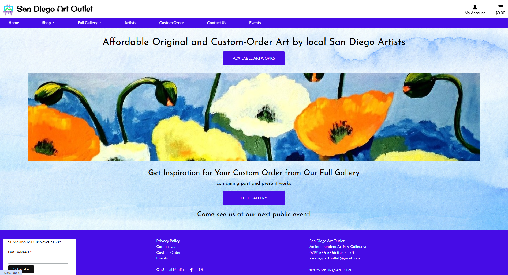

# Testing for San Diego Art Outlet

# Table of Contents
1. [Validation](#validation)
    - [Python](#python)
    - [CSS](#css)
    - [JavaScript](#javascript)
    - [HTML](#html)
2. [User Stories](#user-stories)

3. [Other Interactive Elements](#other-interactive-elements)

4. [Browser Compatibility](#browser-compatibility)

5. [Responsiveness](#responsiveness)

## Validation

### Python
Python files were tested using flake8 in VS Code. The results are as follows, with 6 lines raising issues:

All six lines will be ignored: Signals are being used in checkout/apps.py and must be registered there. The next four lines are for too-long lines of code in settings.py, but experimenting with breaking up those lines resulted in errors, so it is best to leave those, as they are generated by django. The handler404 is indeed being used to enable the custom 404 error message in deployment.

Thus there are no python files that need fixing.
### CSS
The following CSS files comprising all of the CSS files I created were validated using the [WC3 CSS Validator](https://jigsaw.w3.org/css-validator/):

- artworks.css

- checkout.css

- base.css

- profile.css

All passed with no errors or warnings.

### JavaScript
All of the JavaScript files of the project were run through JSHint.

| file | results | comment |
|------|---------|---------|
| artists.js | no errors or warnings | |
| stripe_elements.js | unrecognized variable Stripe | This was expected and is needed for Stripe functionality in the project |
| countryfields.js | warning of unnecessary semicolon | ignored because the linter also didn't recognize the $ symbol being used in the code, and the semicolon was in the correct place and necessary |

### HTML

| file | results | comment |
|------|---------|---------|
| base.html |  | indirectly checked as part of other pages |
| index.html | no errors or warnings |  |
| shop.html | no errors or warnings  |  |
| add_artwork.html | no errors or warnings |  |
| artist_add_art.html | no errors or warnings |  |
| artist.html | no errors or warnings |  |
| artists.html | no errors or warnings |  |
| artwork_detail.html | no errors or warnings |  |
| gallery.html |  |  |
| update_artwork.html | no errors or warnings |  |
| artwork_image.html |  |  |
| artwork_info.html |  |  |
| artwork_price.html |  |  |
| cart.html |  |  |
| delete_from_cart.html |  |  |
| checkout_success.html |  |  |
| checkout.html |  |  |
| contact_us.html | no errors or warnings |  |
| custom-request.html | no warnings or errors |  |
| events.html | no errors or warnings |  |
| profile.html |  |  |

## User Stories

## Other Interactive Elements

## Browser Compatibility

## Responsiveness
The website is fully responsive on all viewports, from mobile through desktop size.

On desktop:

On Laptop:

On small mobile:

On small tablet:

On large tablet:

## Lighthouse Results

- Homepage

- Shop

    - acrylic paintings only in Shop

- Gallery

- Artists page

- Artist's page

- Contact Us page

- Custom Order Request page

Some of the details from the above results:

It seems clear from the results of the gallery page that better image handling is necessary. This page has the most artworks and contains a lot of photography as well. One lighthouse suggestion is to delay rendering of off-screen images, and it would be a good idea to implement pages here, rather than infinite scroll, especially for the gallery but even for the shop.

The best practices score is consistent throughout and is mainly due to the implementation of Stripe.

Serving images in next-gen formats is also something I would look into. I believe Cloudinary may have been a better choice for this app, as it seems more user friendly, and I know there are easy ways to work with the images to serve them dynamically at the sizes required while they are being served.

One issue that deserves attention is shown in the second-to-last image here and concers security. In the project's present iteration, this is not serious, as no real purchases are being made, but if one wanted to go live with the project (in terms of Stripe--not just in test mode), this would be an issue to understand and address in advance.

Features and User Stories
## Features and User Stories
### User Stories Table

| User Story | User Story Title | Fulfilling app or feature |
|------------|------------------|---------------------------|
| #1 | As a site visitor I can view a list of available art to see if there is something I want to purchase | Artworks app, Artworks page (Shop) |
| #3 | As a user I can easily access full product details, including price, artist, size, medium, etc., so that I can make an informed decision about whether to buy the item | Artwork detail page |
| #4 | A first time visitor can quickly determine the purpose and offerings of the site so they can decide if they want to explore further | Home app, Homepage |
| #5 | As a site visitor, I can sort the available art by medium so I can quickly find what I am looking for | Artworks app, Shop and Gallery pages, navbar |
| #7 | As a user, I can submit a custom order inquiry without submitting an order so that an artist can contact me later about my requirements | Communications App, Custom Order page and form, Admin |
| #9 | As a user I want to be able to add items to a shopping cart so that I can create a running list of things I want to buy before I proceed to checkout | Cart App |
| #12 | As a shopper I want to review the order information on the checkout page so I can ensure it is correct before making my purchase | Checkout App, checkout page |
| #13 | As a shopper I can review my shopping cart so that I can see which items I have added and what the current grand total is so I don't overspend | Cart App |
| #14 | As a shopper, I want to be able to delete items from my cart so that I can revise my order before purchasing | Cart App |
| #21 | As a site owner or artist, I can add, update and delete items for sale from the front end so that the inventory shown to users is accurate | Product Management Function, Artist's Page |
| #23 | As a site owner I can display information about the artists of the works for sale to drive user engagement and promote the artists | Artists page, Artists' pages |
| #24 | As a site owner, I can display a custom 404 message so that my website maintains a professional look | Custom 404 page |
| #27 | (Future Feature) As a contributing artist I can update and delete my artist information on the front end so that I can optimize my artist page | Future Feature in Artworks App and Artist's page |
| #28 | As a user, I want to be able to see my current total at all times so I can stay within my budget or just easily keep track of my spending | Cart App, Navbar |
| #31 | As a new user, I can create an account using my email and password so I can enjoy full site functionality | Login form (and real emails) |
| #32 | As a user I want to know that my account is secure and has been created so I can be sure that only I have access using my credentials | User Registration and real emails |
| #34 | As a logged-in user, I can save the information I enter during checkout to my account profile so that I don't have to re-enter my information each time I make a purchase | Profile App, checkbox on checkout page |
| #35 | As a user, I can update my account information so that it remains accurate | Profile App |
| #36 | As a user, I can enter my shipping and payment information so that I can complete my order | Checkout App |
| #37 | As a user I can receive an email confirmation of my completed order so I have a record of my purchase and order information | E-mail confirmations |
| #38 | (Future Enhancement) As an artist or site owner, I can create a custom order based on an online inquiry and make the product available only to a specific user for purchase online | Custom Order Inquiry, Artworks, and User models suitably related to provide future functionality (with probable addition of a CustomOrder model) |
| #41 | As a site owner, I can handle webhooks from Stripe to ensure that payment and order processes are fully handled | Checkout App |
| #44 | As a business owner, I want to be able to receive messages from customers or collaborators so I can respond as required by my business | Communications App, Contact Us nav and form, Admin |
| #45 | As a visitor to the site I can sign up for a newsletter so I can be aware of upcoming shows or other news | Newsletter signup in footer through MailChimp | 

### Homepage, Navigation and Footer
**User story 4: A first time visitor can quickly determine the purpose and offerings of the site so they can decide if they want to explore further**

The homepage is shown below. Prominent buttons for the shop and gallery, a shopping cart, a pretty piece of art, and the single headline and the clear nav items show the user at glance exactly what the site is for, with the subheading further emphasizing the site's possibilities. The nav elements that are expandable have small arrows to indicate that those menus are expandable. Without leaving the homepage, just by toggling the shop or gallery nav elements, the user can see what types of art are available.

Mobile Navigation dropdown from hamburger menu:

Mobile dropdown navigation:

Nav elements are different for logged in or non-logged-in users, and for superusers, as follows:

Not logged in: The My Account dropdown menu shows the options to register or login

Logged in user: The My Account dropdown menu shows the options **My Profile** and **Logout** (as in the image for the superuser, except without the Product Management option).

Superuser: In addition to the logged in user, the superuser sees **Product Management** in the dropdown menu under My Account.

**User story 45: As a visitor to the site I can sign up for a newsletter so I can be aware of the upcoming shows or other news**

The footer includes a MailChimp sign-up form for the newsletter, displayed prominently, as well as other links to actions the user might take, such as contacting the business or sending a custom-order request. The privacy policy and social media links are there as well, all three of which open in new tabs.

 
### Shop and Gallery
**User story 1: As a site visitor I can view a list of available art to see if there is something I want to purchase** 

The user who visits the shop page finds a list of all available artworks.

**User Story 5: As a site visitor, I can sort the available art by medium so I can quickly find what I am looking for**
The user can sort artworks even before they get to the shop or gallery or from inside the shop and gallery, as the navbar is visible all the same.
When the user chooses a medium, only artworks of that medium show in the shop until they choose a different medium, all artworks, or navigate away.

The gallery is nearly identical to the shop, except that users can also see works that have already been sold. This is designed to help them come up with ideas for custom orders.

### Artwork detail page
**User story 3: As a user I can easily access full product details, including price, artist, size, medium, etc., so that I can make an informed decision about whether to buy the item**

In the shop or gallery, when a user hovers over a piece of artwork, that card gets a thick border (and jumps a bit) to indicate it is clickable. On the artwork detail page, users can see all relevant information about an artwork. 

No hover:

Hovered:

On the artwork detail page, the individual artwork that is *for sale* appears with a button to add it to the shopping cart and buttons to return to the shop or the gallery.

An artwork that is already *sold*, however, appears only with a button to return to the gallery (as the user will have come from there unless they came from the artist's page, but in any case, they won't have come from the shop, as no sold artworks appear in the shop).

Clicking on "view full image" opens the image in another tab so the user can get a good look at the piece.

### The Shopping Cart
**User story 7: As a user I want to be able to add items to a shopping cart so that I can create a running list of things I want to buy before I proceed to checkout**

The user is able to add an artwork to the shopping cart by clicking the Add to Cart button on the artwork detail page. When the user does this, they receive a pop up success message near the shopping cart icon containing the contents of their cart.

**User story 13: As a shopper I can review my shopping cart so that I can see which items I have added and what the current grand total is so I don't overspend**

The user can click the shopping cart icon from any page to review the contents of their cart.

**User story 14: As a shopper, I want to be able to delete items from my cart so that I can revise my order before purchasing**

The image above shows the delete link for items in a shopping cart. When a user clicks the link, the item is deleted from their cart, and they receive a success message and stay on the cart page to see what remains, if anything, with a button to return to the shop or go to secure checkout.

### Artists page
** User story 23: As a site owner I can display information about the artists of the works for sale to drive user engagement and promote the artists**

The artists page displays all artists with artworks on the site, with a photo of them, a short bio, and a link to their individual artist's page. Full bios appear on the individual **artists' pages**, described in the next subsection. The content for these pages is not yet fully developed but would be one of the first elements to enhance, both for SEO and user engagement. Each artist would be expected to provide a colorful, interesting bio to attract customers, as well as more photos of their past works, not to mention photos of their works hanging in actual homes.

### Artists' pages
*User story 23, as above*
**User story 21: As a site owner or artist I can add, update and delete items for sale from the front end so that the inventory shown to users is accurate**

This user story is fulfilled in two ways: 1. for the artist, and 2. for the superuser. See also the [Product Management](#product-management-front-end) section below for more about superuser functionality.

Seen by the regular user, the artist's page simply displays the artist's works that have the status *for sale* or *sold*, as opposed to *pending*.

The artist's individual pages have the following functionality: 

An artist who has been *linked to a user account manually on the back end*, thus at the site owner's discretion, will see a link just under their bio for **adding** their artworks. The superuser sees the same. From the artist's page, no matter how they fill in the form (i.e., if they mistakenly choose another artist as artist), any artwork they add is added with the artist whose page it is as the *artist* of the artwork and as status *pending*, so that it won't appear immdediately on the site. This is so that the site owner has a chance to review the image and content and approve it before publication. On the same page, the site owner can simply update the artwork to change its status to *for sale* if they wish. (If the owner does not want to go through this extra step, they can use the Manage Artworks functionality that only they have access to, available in the dropdown menu under My Account. See the [Product Management](#product-management-front-end) section below for more on this.)

Clicking on the pending artwork to view its details brings the artist or superuser to the artwork detail page, where, instead of seeing the usual card containing the artwork details and buttons for adding to cart or returning to gallery or shop, they see the following message, designed to allow the artist or superuse to find the art they just added, even if they mistakenly entered the wrong artist (or simply forgot which artist it was). The link brings them to the artist's page where the artwork can be found.

The artist who tries to **update** an image receives an error message and is redirected back to the homepage. Future enhancement would involve sending the artist back to their own page.

An (authorized) artist can delete their own artwork from their artist page, but *only if that artwork's status is still pending*. Trying to delete an artwork with status *sold* or *for sale* results in an error message. This is to prevent artists from deleting objects related to already processed orders or users' shopping carts.

#### Customer View
The customer does not see any update or delete links and has no access to the product management menu.

#### Artist's view

The artist sees what the superuser sees on their own page only. They have no access to the product management menu.

### Product Management: Full CRUD
**User story 21: As a site owner** (or artist, see above section for artist functionality) **I can add, update and delete items for sale from the front end so that the inventory shown to users is accurate**

The superuser can create, read, update and delete artworks from the Product Management link, for adding a new artwork, or through links below each artwork image, anywhere it appears on the site.

Accessing the form from the menu:

Accessing the form by clicking on "update artwork" under an artwork image, where the form is pre-filled and the user receives a toast message informing them of the artwork being updated:

When the superuser adds an artwork without an image, it is saved as pending, and they are redirected to the artist's page for easy access, as that is the only place it is accessible on the front end.

If the superuser saves an artwork with an image and a status of *for sale*, it is saved and the superuser is redirected to the artwork detail page and presented with a success message.

Attempting to add an artwork without an image results in the artwork being saved as "pending" so that it does not show up on the public site, even if the person adding it forgot to change the default status from "for sale" to "pending". Below is the message received by the superuser who has done so, having been redirected at the same time to the artist's page so they can continue working with the object.

The object can still be managed from the artist's page, and as soon as they include an image, the status can be easily changed from "pending" to "for sale" or "sold". Even if someone accidentally changes the status of an object with no image to "for sale" or "sold" on the back end, there is no way for a customer to add the object to their cart because no object without an image appears to a regular user anywhere on the site. (This final feature was added during testing. More on this under [Fixed bugs](#fixed-bugs)!).

Artwork can only be updated by the superuser by clicking the update artwork link whereever an artwork is displayed to the superuser.

The form is prefilled with the object's current data:

Successful update brings the user to the artwork detail page for that artwork.

### Custom Order Request
**User story 7: As a user, I can submit a custom order inquiry without submitting an order so that an artist can contact me later about my requirements**

To send a custom order inquiry, the user has only to click on Custom Order in the navbar or in the footer. It was decided that only logged in users should be able to submit custom orders for several reasons: to prevent casual requests from users who are merely curious but not likely to follow through, and more importantly, to prevent the user typing in a wrong email and the business losing an opportunity. The user can still enter a different name and email, but on the back end the site owner can see which user sent the form, just in case. (Some users might prefer to use a different email in any case, such as when "asking for a friend".) It was also decided that the user, whether logged in or not, should be directed to a page containing the form (although the form is hidden for non-logged in users). This is so that more content can be added at a later date and to present the non-logged in user with the option to either log in or send a message through the contact form, which does not require logging in.

A user who is not logged in receives the following message, with an invitation to log in or send a message through the contact form (which does not require login):

### Events page
### Newsletter signup
### Register, Login and Logout
**User story 31: As a new user I can create an account using my email and password so I can enjoy full site functionality**

**User story 32: As a user I want to know that my account is secure and has been created so I can be sure that only I have access using my credentials**

Clicking on register in the nav menu brings the user to the signup form:

Filling in the form with valid data results in a message as follows:

After the user submits the sign-up form, they receive an email asking them to confirm that they signed up:

Clicking on the link brings them to this page on the website:

And clicking on that brings them to the sign-in form with a success message that their account was verified, at which point they can sign in.:

A user can log out by clicking on logout in the My Account menu, where they are brought to this page asking for confirmation:

A user can also reset their password if they have forgotten it. Clicking on the forgot password link sends an email to the user which, when clicked on, brings them to a page to reset their password.

### Customer Profile page
**User story 35: As a user, I can update my account information so that it remains accurate**
#### Update profile form

### Webhooks